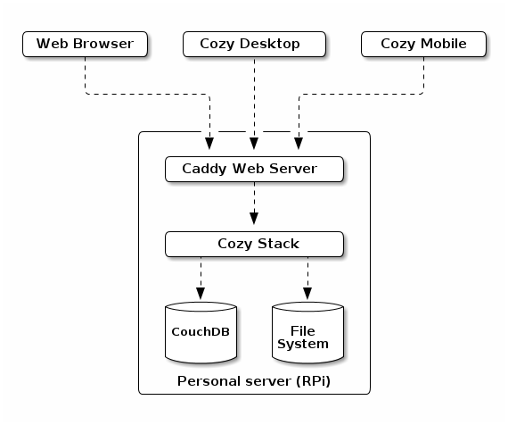
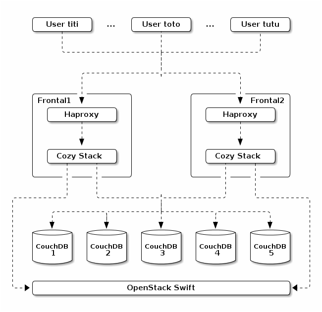

Cozy Cloud Architecture
=======================

What is Cozy Cloud?
-------------------

Cozy Cloud is a personal platform as a service with a focus on data.
Cozy Cloud can be seen as 4 layers, from inside to outside:

1. A place to keep your personnal data
2. A core API to handle the data
3. Your web apps, and also the mobile & desktop clients
4. A coherent User Experience

It's also a set of values: Simple, Versatile, Yours. These values mean a lot
for Cozy Cloud in all aspects. From an architectural point, it declines to:

- Simple to deploy and understand, not built as a galaxy of optimized
  microservices managed by kubernetes that only experts can debug.
- Versatile, can be hosted on a Raspberry Pi for geeks to massive scale on
  multiple servers by specialized hosting.
- Yours, you own your data and you control them. If you want to take back your
  data to go elsewhere, you can.

Overview
--------

The architecture of Cozy Cloud is composed of:

- a reverse proxy
- the cozy stack
- a couchdb instance to persist the JSON documents
- a space for storing files.

All of this can run on a personal server, self-hosted at home, like a
Raspberry Pi:

But it's also possible to deploy a farm of servers for hosting thousands of
cozy instances. It will looks like this:

This elasticity comes with some constraints:

- most applications are run in the browser, not in the server
- what must run on the server is mutualized inside the cozy stack
- the cozy stack is stateless
- the data are stored in couchdb and a space for files
- a couchdb database is specific to an instance (no mix of data from 2 users
  in the same database).

### Reverse proxy

The reverse proxy is here to accept HTTPS connexions and forward the request
to the cozy stack. It's here mainly to manage the TLS part.

### The Cozy Stack

The Cozy Stack is a single executable. It can do several things but it's most
important usage is starting an HTTP server to serve as an API for all the
services of Cozy, from authentication to real-time events. This API can be
used on several domains. Each domain is a cozy instance for a specific user
("multi-tenant").

### Databases

The JSON documents that reprensent the users data are stored in CouchDB, but
they are not mixed in a single database. We don't mix data from 2 users in the
same database. It's easier and safer to control the access to the data by
using different databases per user.

But we think to go even farther by spliting the data of a user in several
databases, one per document type. For example, we can have a database for the
emails of a user and one for her todo list. This can simplify the
implementation of permissions (this app has access to these document types)
and can improve performances. CouchDB queries work with views. A view is
defined ahead of its usage and is built by couchdb when it is requested and is
stale, ie there were writes in the database since the last time it was
updated. So, with a single database per user, it's possible to experience lag
when the todolist view is requested after fetching a long list of emails. By
spliting the databases per doctypes, we gain on two fronts:

1. The views are updated less frequently, only when documents of the matching
doctypes are writen.
2. Some views are no longer necessary: those to access documents of a specific
doctypes.

There are downsides, mostly:

1. It can be harder to manage more databases
2. We don't really know how well CouchDB will perform with so many databases
3. It's no longer possible to use a single view for documents from doctypes
that are no longer in the same database.

We think that we can work on that and the pros will outweight the cons.

Services
--------

The cozy stack came with several services. They run on the server, inside the
golang processus and have an HTTP interface.

### Authentication `/auth`

The cozy stack can authenticate the owner of a cozy instance. This can happen
in the classical web style, with a form and a cookie, but also with OAuth2 for
remote interactions like cozy-mobile and cozy-desktop.

### Applications `/apps`

It's possible to manage serverless applications from the cozy stack and serve
them via cozy stack. The stack does the routing and serve the HTML and the
assets for the applications.

### Data System `/data`

CouchDB is used for persistence of JSON documents. The data service is a layer
on top of it for routing the requests to the corresponding CouchDB database
and checking the permissions.

In particular, a serverless application can declare some contexts and access
data in those contexts even if it's not the owner of the cozy instance that
access it. For example, the owner of a cozy can create a photo album with a
selection of photos. This album can then be associated to a context to be
shared with friends of the owner. These friends can access the album and see
the photos, but not anonymous people.

### Virtual File System `/files`

It's possible to store files on the cozy, including binary ones like photos
and movies, thanks to the virtual file system. It's a facade, with several
implementations, depending on where the files are effectively stored:

- in a directory of a local file system (easier for self-hosted users)
- Swift from Open Stack (convenient for massive hosting)

The range of operations possible with this endpoint goes from simple ones,
like uploading a file, to more complex ones, like renaming a folder. It also
ensure that an instance is not exceeding its quota.

### Jobs `/jobs`

The cozy stack has queues where job descriptions can be put. For example, a
job can be to fetch the latest bills from a specific provider. These queues
can be consumed by external workers to complete the associated jobs.

We can imagine having a media worker that extract thumbnails from photos and
videos. It will fetch jobs from a media queue and each job description will
contain the path to the photo or video from which the thumbnail will be
extracted.

There is also a scheduler that acts like a crontab. It can add jobs at
recurrent time. For example, it can add a job for fetching github commits
every hour.

Later, we can dream about having more ways to create jobs (webhooks, on
document creation) and make them communicate. With a web interface on that, it
can become a simplified [_Ifttt_](https://ifttt.com/).

### Sync `/sync`

This endpoint will be for synchronizing your contacts and calendars by using
standard methods like caldav and carddav.

### Settings `/settings`

Each cozy instance has some settings, like its domain name, its language, the
name of its owner, the background for the home, etc.

### Notifications `/notifications`

The applications can put some notifications for the user. That goes from a
reminder for a meeting in 10 minutes to a suggestion to update your app.

### Real-time `/real-time`

This endpoint can be use to subscribe for real-time events. An application
that shows items of a specific doctype can listen for this doctype to be
notified of all the changes for this doctype. For example, the calendar app
can listen for all the events and if a synchronization with the mobile adds a
new event, the app will be notified and can show this new event.

### Status `/status`

It's here just to say that the API is up and that it can access the CouchDB
databases.

Workers
-------

The workers take jobs from the queues and process them.

### Fetch emails `/jobs/mailbox`

It fetches a mailbox to synchronize it and see if there are some new emails.

Payload: the mailbox

### Send email `/jobs/sendmail`

It connects to the SMTP server to send an email.

Payload: mail account, recipient, body, attachments

### Extract metadata `/jobs/metadata`

When a file is added or updated, this worker will extract its metadata (EXIF
for an image, id3 for a music, etc.)

Payload: the filepath

### Konnectors `/jobs/konnector`

It synchronizes an account on a remote service (fetch bills for example).

Payload: the kind of konnector, the credentials of the account and some
optional parameters (like the folder where to put the files)

### Registry `/jobs/registry`

It updates the list of available applications.

Payload: none

### Indexer `/jobs/indexer`

When a JSON document is added, updated or deleted, this worker will update the
index for full text search.

Payload: the doctype and the document to index

Serverless apps
---------------

### Home `/apps/home` (and aliased to `/` by default)

It's where you land on your cozy and launch your apps. Having widgets to
display informations would be nice too!

### App Center (was marketplace) `/apps/app-center`

You can install new apps here.

### Activity Monitor (was My apps) `/apps/activity-monitor`

It's a list of your installed apps and devices.

### My Accounts (was konnectors) `/apps/my-accounts`

You can configure new accounts, to fetch data from them, and see the already
configured accounts.

### Preferences `/apps/preferences`

You can set the settings of your cozy, choose a new background for the home,
and select a theme.

### Devtools `/apps/devtools`

Some tools for the developpers of applications only: an API console,
documentation, logs of the permission checks, etc.

### Contacts `/apps/contacts`

Manage your contact books.

### Calendar `/apps/calendar`

Manage your events and alarms.

### Emails `/apps/emails`

A webmail client to read, send and backup your emails.

### Files `/apps/files`

A web interface to browse your files.

### Photos `/apps/photos`

Organize your photos and share them with friends.

### Todo list `/apps/todo`

A task manager to never forgot what you should do.

### Onboarding `/apps/onboarding`

Start your cozy and setup your accounts.

Guidelines
----------

### Golang

Why?

- used by a lot of people -> https://github.com/golang/go/wiki/GoUsers
- http://redmonk.com/sogrady/2016/07/20/language-rankings-6-16/
- https://github.com/golang/go/wiki/GoArm
- some known open source projects: docker, kubernetes, grafana, syncthing,
  influxdb, caddy, etc.

### Rest API

- Gin framework
- Best pratices (jsonapi)

### How to contribute?

- documentation for the cozy stack and the core apps
- tools to make it simple to create a new app
- it should be easy to add a new konnector

FAQ
---

> Does the current konnectors in nodejs will be lost?

No, they won't. The business logic to scrap data from the many sources will be
kept and they will be adapted to fit in this new architecture. It won't be a
daemonized http server anymore, just some node scripts. The Cozy Stack will
listen for jobs for them and, then, will launch these nodejs scripts with the
right parameters.

> So, it's not possible to have a custom application with a server part, like
the lounge IRC client?

We want to support this use case, just not on the short term. It's not clear
how we can do that (and not weakening the security). One idea is to run the
applications in a different server, or maybe in docker.

> How to install and update cozy?

The Cozy Stack will have no auto-update mechanism. For installing and updating
it, you can use the classical ways:

- using a package manager, like apt for debian & ubuntu
- using an official image for Raspberry Pi (and other embedded platforms)
- using the image and services of an hosting company
- or compiling and installing it manually if you are really brave ;-)

> How to add a cozy instance to a farm?

1. Choose a (sub-)domain and configure the DNS for this (sub-)domain
2. Configure the reverse-proxy to accept this (sub-)domain
3. Use the `cozy` executable to configure the cozy stack

> How to migrate from the nodejs cozy to this new architecture for cozy?

1. Export the data from the nodejs cozy (we need to add a button in the web
interface for that in the coming months)
2. Install the new cozy
3. Import the data

Please note that we don't support a continuous replication method that will
enable to use both the nodejs and the new architecture at the same time. It
looks too complicated for a temporary thing.

> How to backup the data?

There are 2 sensitive places with data:

- in CouchDB
- on the place used for the Virtual File System (a directory on the local
  filesystem, or in Swift).

You can use the tools of your choice to backup these 2 locations. The good old
rsync works fine (CouchDB files are append-only, except when compaction
happens, so it's friendly to rsync).

It's highly recommended to have an automated backup, but sometimes it can be
useful to have a way to backup manually the data. The "export data" button in
the web interface give a tarball that can be used to transfer your data from
one instance to another, and so, it can be used as a backup.

TODO
----

- say a word on metrics
- explain auth for users + apps + context
- explain permissions
- context for sharing a photos album
- import/export data ("you will stay because you can leave")
- security
- performances
- [The 12-factor app](http://12factor.net/)
- doctype with Romain
- intent
