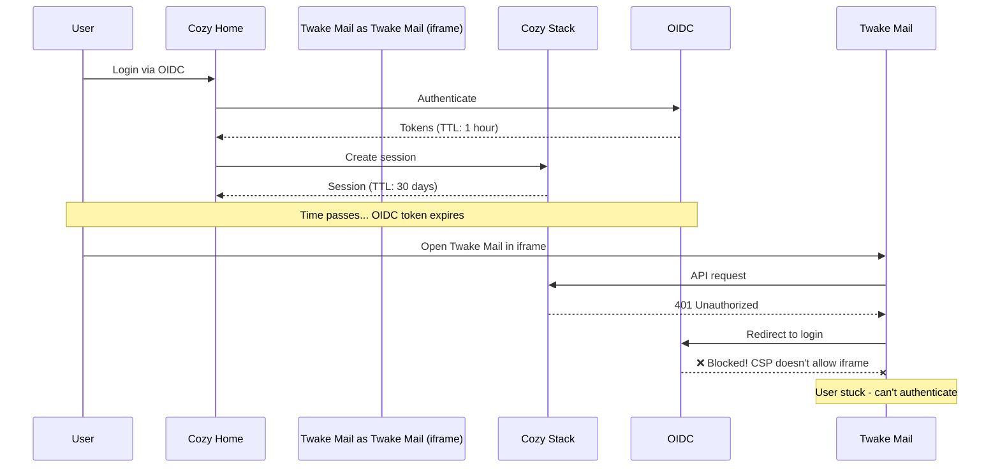

# ADR: OIDC Token TTL Improvements

## Status

**Proposed**

## Context

In multi-application deployments where Twake Workplace serves applications (like Twake Mail) in iframes, 
there is a fundamental disconnect between cozy-stack session management and OIDC token validity.

#### Real-World Scenario: pommes.fr Deployment

```
Domain Structure:
├── auth.pommes.fr          ← OIDC Provider
└── *.workplace.pommes.fr   ← Twake Workplace apps
    ├── home.workplace.pommes.fr
    └── Twake Mail.workplace.pommes.fr (iframe)
```

**Problem Flow:**



#### Root Cause

Cozy-stack sessions (30 days) are completely independent of OIDC token validity (typically 1 day)

#### Impact

- Users appear logged into Cozy but embedded apps fail silently
- OIDC provider login page cannot load in iframe (CSP `frame-ancestors` restriction)
- Poor user experience with no clear path to resolution


### Current Implementation

The cozy-stack currently supports OpenID Connect (OIDC) for delegated authentication. When a user authenticates via OIDC, the stack:

1. Exchanges the authorization code for tokens (`access_token`, `id_token`, optionally `refresh_token`)
2. Uses the `access_token` once to call the UserInfo endpoint
3. Extracts the `sid` (session ID) from the `id_token` for logout support
4. Discards all OIDC tokens immediately after use
5. Issues its own cozy-stack OAuth tokens to the client

The current token response parsing only captures two fields:

```go
type tokenResponse struct {
    AccessToken string `json:"access_token"`
    IDToken     string `json:"id_token"`
}
```

### Current Limitations

| Limitation | Impact |
|------------|--------|
| OIDC `refresh_token` not captured | Cannot refresh OIDC access token when it expires |
| OIDC `expires_in` not captured | No awareness of token TTL |
| OIDC `access_token` not stored | Cannot make subsequent calls to OIDC-protected APIs on behalf of user |
| Session TTL independent of OIDC | Sessions valid long after OIDC token expires |
| No lifecycle validation | Token validity not checked after initial auth |
| Back-channel logout deletes ALL sessions | Should use `sid` for per-device logout |


## Proposal

### Extend Token Response Parsing

Update the `tokenResponse` struct to capture all relevant fields:

```go
type tokenResponse struct {
    AccessToken  string `json:"access_token"`
    IDToken      string `json:"id_token"`
    RefreshToken string `json:"refresh_token,omitempty"`
    ExpiresIn    int64  `json:"expires_in,omitempty"`
    TokenType    string `json:"token_type,omitempty"`
}
```

#### Store OIDC Tokens on OAuth Client

Extend the `oauth.Client` struct to store OIDC tokens:

```go
type Client struct {
    // ... existing fields ...

    // OIDC token storage
    OIDCSessionID      string     `json:"oidc_session_id,omitempty"`       // Existing
    OIDCAccessToken    string     `json:"oidc_access_token,omitempty"`     // New
    OIDCRefreshToken   string     `json:"oidc_refresh_token,omitempty"`    // New
    OIDCTokenExpiresAt *time.Time `json:"oidc_token_expires_at,omitempty"` // New
}
```

#### Store OIDC Token Expiry on Session

Extend the `session.Session` struct:

```go
type Session struct {
    // ... existing fields ...
    SID                string     `json:"sid,omitempty"`                   // Existing
    OIDCTokenExpiresAt *time.Time `json:"oidc_token_expires_at,omitempty"` // New
}
```

###  Session TTL Alignment

#### Session Validity Middleware

Add HTTP middleware that checks OIDC token expiry on each request: 
if the token is expired, return a 401 Unauthorized response with an `oidc_token_expired` error indicating re-authentication is required.

### Back-Channel Logout Fix

Per-Device Logout Using SID

### Extended Configuration Options

```yaml
authentication:
  the-context-name:
    oidc:
      # ... existing config ...

      # Token storage (Part A)
      store_tokens: true                    # Enable OIDC token storage (default: false)

      # Session alignment (Part C)
      align_session_ttl: true               # Tie session validity to OIDC token (default: false)
```

## Alternatives

### Store Tokens in Session Instead of OAuth Client

Store OIDC tokens in the `session.Session` document instead of `oauth.Client`.


###  Encrypt Stored Tokens

Encrypt OIDC tokens before storing in CouchDB.


## Decision

## Consequences

Desktop/Mobile apps will have token with the same short TTL