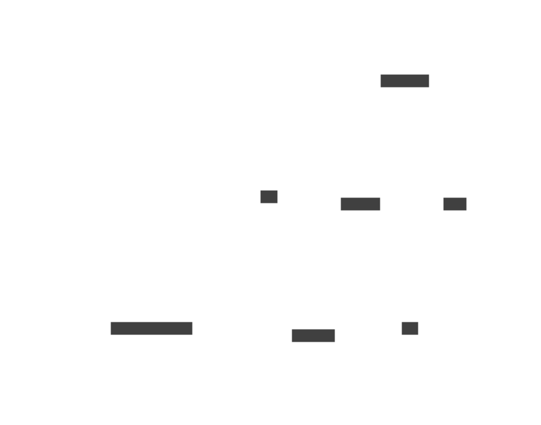

[Table of contents](README.md#table-of-contents)

# AI for personal data

## Introduction

AI can be used for interacting with the personal data of a Cozy. This is
currently an experimental feature. Retrieval-Augmented Generation (RAG) is
a classical pattern in the AI world. Here, it is specific to each Cozy.



## Indexation

First of all, the RAG server must be installed with its dependencies. It is
not mandatory to install them on the same servers as the cozy-stack. And the
URL of RAG must be filled in cozy-stack configuration file (in `rag`).

For the moment, the feature is experimental, and a trigger must be created
manually on the Cozy:

```sh
$ COZY=cozy.localhost:8080
$ TOKEN=$(cozy-stack instances token-cli $COZY io.cozy.triggers)
$ curl "http://${COZY}/jobs/triggers" -H "Authorization: Bearer $TOKEN" -d '{ "data": { "attributes": { "type": "@event", "arguments": "io.cozy.files", "debounce": "1m", "worker": "rag-index", "message": {"doctype": "io.cozy.files"} } } }'
```

It can also be a good idea to start a first indexation with:

```sh
$ cozy-stack triggers launch --domain $COZY $TRIGGER_ID
```

In practice, when files are uploaded/modified/deleted, the trigger will create
a job for the index worker (with debounce). The index worker will look at the
changed feed, and will call the RAG for each entry in the changes feed.

## Chat

When a user starts a chat, their prompts are sent to the RAG that can use the
vector database to find relevant documents (technically, only some parts of
the documents called chunks). Those documents are added to the prompt, so
that the LLM can use them as a context when answering.

### POST /ai/chat/completions/:id

This route can be used to ask AI for a chat completion. The id in the path
must be the identifier of a chat session. The client can generate a random
identifier for a new chat session.

The stack will respond after pushing a job for this task, but without the
response. The client must use the real-time websocket and subscribe to
`io.cozy.ai.chat.events`.

#### Request

```http
POST /ai/chat/completions/e21dce8058b9013d800a18c04daba326 HTTP/1.1
Content-Type: application/json
```

```json
{
  "q": "Why the sky is blue?"
}
```

#### Response

```http
HTTP/1.1 202 Accepted
Content-Type: application/vnd.api+json
```

```json
{
  "data": {
    "type": "io.cozy.ai.chat.completions"
    "id": "e21dce8058b9013d800a18c04daba326",
    "rev": "1-23456",
    "attributes": {
      "messages": [
        {
          "role": "user",
          "content": "Why the sky is blue?"
        }
      ]
    }
  }
}
```

### Real-time via websockets

```
client > {"method": "AUTH", "payload": "token"}
client > {"method": "SUBSCRIBE",
          "payload": {"type": "io.cozy.ai.chat.events"}}
server > {"event": "CREATED",
          "payload": {"id": "e21dce8058b9013d800a18c04daba326",
                      "type": "io.cozy.ai.chat.events",
                      "doc": {"object": "delta", "content": "The "}}}
server > {"event": "CREATED",
          "payload": {"id": "e21dce8058b9013d800a18c04daba326",
                      "type": "io.cozy.ai.chat.events",
                      "doc": {"object": "delta", "content": "sky "}}}
[...]
server > {"event": "CREATED",
          "payload": {"id": "e21dce8058b9013d800a18c04daba326",
                      "type": "io.cozy.ai.chat.events",
                      "doc": {"object": "done"}}}
```
