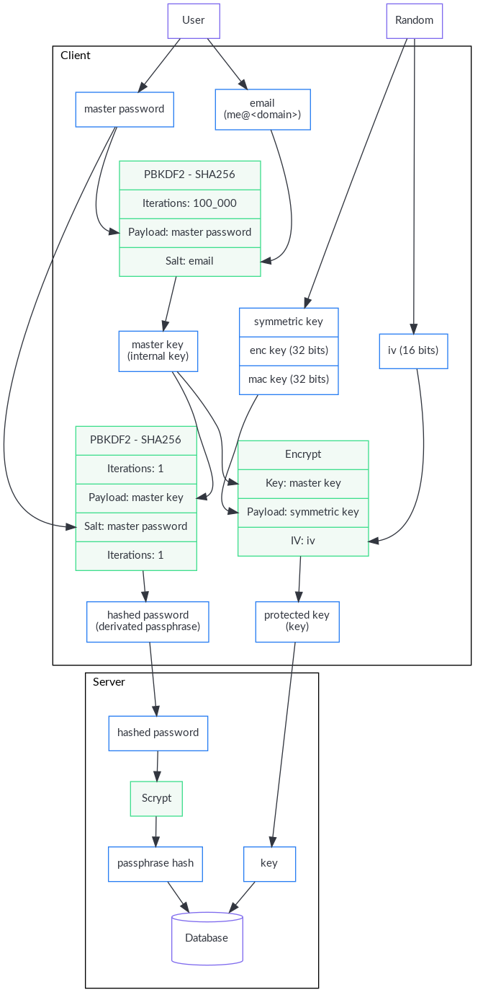

[Table of contents](README.md#table-of-contents)

# Bitwarden

Cozy-stack exposes an API compatible with
[Bitwarden](https://github.com/bitwarden) on `/bitwarden`.

The author of the [unofficial Bitwarden-ruby
server](https://github.com/jcs/rubywarden) did some reverse engineering and
wrote a short [API
documentation](https://github.com/jcs/rubywarden/blob/master/API.md).

## Setup

The signup is disabled, there is one account per Cozy instance, with the email
`me@<domain>`. When the user chooses his/her password (onboarding), an encryption key
is also generated to keep safe the secrets in the bitwarden vault.



## Routes for accounts and connect

### POST /bitwarden/api/accounts/prelogin

It allows the client to know the number of KDF iterations to apply when hashing
the master password.

#### Request

```http
POST /bitwarden/api/accounts/prelogin HTTP/1.1
Host: alice.example.com
Content-Type: application/json
```

```json
{
  "email": "me@alice.example.com"
}
```

#### Response

```http
HTTP/1.1 200 OK
Content-Type: application/json
```

```json
{
  "Kdf": 0,
  "KdfIterations": 10000,
}
```

### POST /bitwarden/identity/connect/token

#### Request (initial connection)

```http
POST /bitwarden/identity/connect/token HTTP/1.1
Host: alice.example.com
Content-Type: application/x-www-form-urlencoded
```

```
grant_type=password&
username=me@alice.example.com&
password=r5CFRR+n9NQI8a525FY+0BPR0HGOjVJX0cR1KEMnIOo=&
scope=api offline_access&
client_id=browser&
deviceType=3&
deviceIdentifier=aac2e34a-44db-42ab-a733-5322dd582c3d&
deviceName=firefox&
devicePushToken=
```

#### Request (refresh token)

```http
POST /bitwarden/identity/connect/token HTTP/1.1
Host: alice.example.com
Content-Type: application/x-www-form-urlencoded
```

```
grant_type=refresh_token&
client_id=browser&
refresh_token=28fb1911ef6db24025ce1bae5aa940e117eb09dfe609b425b69bff73d73c03bf
```

#### Response

```http
HTTP/1.1 200 OK
Content-Type: application/json
```

```json
{
  "access_token": "eyJhbGciOiJSUzI1NiIsImtpZCI6IkJDMz[...](JWT string)",
  "expires_in": 3600,
  "token_type": "Bearer",
  "refresh_token": "28fb1911ef6db24025ce1bae5aa940e117eb09dfe609b425b69bff73d73c03bf",
  "Key": "0.uRcMe+Mc2nmOet4yWx9BwA==|PGQhpYUlTUq/vBEDj1KOHVMlTIH1eecMl0j80+Zu0VRVfFa7X/MWKdVM6OM/NfSZicFEwaLWqpyBlOrBXhR+trkX/dPRnfwJD2B93hnLNGQ="
}
```

### GET /bitwarden/api/accounts/profile

#### Request

```http
GET /bitwarden/api/accounts/profile HTTP/1.1
Host: alice.example.com
```

#### Response

```http
HTTP/1.1 200 OK
Content-Type: application/json
```

```json
{
  "Id": "0fbfc68d-ba11-416a-ac8a-a82600f0e601",
  "Name": "Alice",
  "Email": "me@alice.example.com",
  "EmailVerified": false,
  "Premium": false,
  "MasterPasswordHint": null,
  "Culture": "en-US",
  "TwoFactorEnabled": false,
  "Key": "0.uRcMe+Mc2nmOet4yWx9BwA==|PGQhpYUlTUq/vBEDj1KOHVMlTIH1eecMl0j80+Zu0VRVfFa7X/MWKdVM6OM/NfSZicFEwaLWqpyBlOrBXhR+trkX/dPRnfwJD2B93hnLNGQ=",
  "PrivateKey": null,
  "SecurityStamp": "5d203c3f-bc89-499e-85c4-4431248e1196",
  "Organizations": [],
  "Object": "profile"
}
```

### POST /bitwarden/api/accounts/security-stamp

It allows to set a new security stamp, which has the effect to disconnect all
the clients. It can be used, for example, if the encryption key is changed to
avoid the clients to corrupt the vault with ciphers encrypted with the old key.

#### Request

```http
POST /bitwarden/api/accounts/security-stamp HTTP/1.1
Host: alice.example.com
Content-Type: application/json
```

```json
{
  "masterPasswordHash": "r5CFRR+n9NQI8a525FY+0BPR0HGOjVJX0cR1KEMnIOo="
}
```

#### Response

```http
HTTP/1.1 204 No Content
```

## Route for sync

### GET /bitwarden/api/sync

The main action of the client is a one-way sync, which just fetches all objects
from the server and updates its local database.

#### Request

```http
GET /bitwarden/api/sync HTTP/1.1
```

#### Response

```http
HTTP/1.1 200 OK
Content-Type: application/json
```

```json
{
	"Profile": {
		"Id": "0fbfc68d-ba11-416a-ac8a-a82600f0e601",
		"Name": "Alice",
		"Email": "me@alice.example.com",
		"EmailVerified": false,
		"Premium": false,
		"MasterPasswordHint": null,
		"Culture": "en-US",
		"TwoFactorEnabled": false,
		"Key": "0.uRcMe+Mc2nmOet4yWx9BwA==|PGQhpYUlTUq/vBEDj1KOHVMlTIH1eecMl0j80+Zu0VRVfFa7X/MWKdVM6OM/NfSZicFEwaLWqpyBlOrBXhR+trkX/dPRnfwJD2B93hnLNGQ=",
		"PrivateKey": null,
		"SecurityStamp": "5d203c3f-bc89-499e-85c4-4431248e1196",
		"Organizations": [],
		"Object": "profile"
	},
	"Folders": [
		{
			"Id": "14220912-d002-471d-a364-a82a010cb8f2",
			"Name": "2.tqb+y2z4ChCYHj4romVwGQ==|E8+D7aR5CNnd+jF7fdb9ow==|wELCxyy341G2F+w8bTb87PAUi6sdXeIFTFb4N8tk3E0=",
			"RevisionDate": "2017-11-13T16:20:56.5633333",
			"Object": "folder"
		}
	],
	"Ciphers": [
		{
			"FolderId": null,
			"Favorite": false,
			"Edit": true,
			"Id": "0f01a66f-7802-42bc-9647-a82600f11e10",
			"OrganizationId": null,
			"Type":1,
			"Login":{
				"Uris": [
					{
						"Uri": "2.6DmdNKlm3a+9k/5DFg+pTg==|7q1Arwz/ZfKEx+fksV3yo0HMQdypHJvyiix6hzgF3gY=|7lSXqjfq5rD3/3ofNZVpgv1ags696B2XXJryiGjDZvk=",
						"Match": null,
					},
				],
				"Username": "2.4Dwitdv4Br85MABzhMJ4hg==|0BJtHtXbfZWwQXbFcBn0aA==|LM4VC+qNpezmub1f4l1TMLDb9g/Q+sIis2vDbU32ZGA=",
				"Password":"2.OOlWRBGib6G8WRvBOziKzQ==|Had/obAdd2/6y4qzM1Kc/A==|LtHXwZc5PkiReFhkzvEHIL01NrsWGvintQbmqwxoXSI=",
				"Totp":null,
			},
			"Name": "2.zAgCKbTvGowtaRn1er5WGA==|oVaVLIjfBQoRr5EvHTwfhQ==|lHSTUO5Rgfkjl3J/zGJVRfL8Ab5XrepmyMv9iZL5JBE=",
			"Notes": "2.NLkXMHtgR8u9azASR4XPOQ==|6/9QPcnoeQJDKBZTjcBAjVYJ7U/ArTch0hUSHZns6v8=|p55cl9FQK/Hef+7yzM7Cfe0w07q5hZI9tTbxupZepyM=",
			"Fields": null,
			"Attachments": null,
			"OrganizationUseTotp": false,
			"RevisionDate": "2017-11-09T14:37:52.9033333",
			"Object":"cipher"
		}
	],
	"Domains": {
		"EquivalentDomains": null,
		"GlobalEquivalentDomains": null,
		"Object": "domains"
	},
	"Object": "sync"
}
```

## Routes for ciphers

### GET /bitwarden/api/ciphers

It retrieves the list of ciphers.

#### Request

```http
GET /bitwarden/api/ciphers HTTP/1.1
```

#### Response

```http
HTTP/1.1 200 OK
Content-Type: application/json
```

```json
{
  "Data": [
    {
      "Object": "cipher",
      "Id": "4c2869dd-0e1c-499f-b116-a824016df251",
      "Type": 1,
      "Favorite": false,
      "Name": "2.d7MttWzJTSSKx1qXjHUxlQ==|01Ath5UqFZHk7csk5DVtkQ==|EMLoLREgCUP5Cu4HqIhcLqhiZHn+NsUDp8dAg1Xu0Io=",
      "FolderId": null,
      "OrganizationId": null,
      "Notes": null,
      "Login": {
        "Uris": [
          {
            "Uri": "2.T57BwAuV8ubIn/sZPbQC+A==|EhUSSpJWSzSYOdJ/AQzfXuUXxwzcs/6C4tOXqhWAqcM=|OWV2VIqLfoWPs9DiouXGUOtTEkVeklbtJQHkQFIXkC8=",
            "Match": null,
          },
        ],
      },
      "Username": "2.JbFkAEZPnuMm70cdP44wtA==|fsN6nbT+udGmOWv8K4otgw==|JbtwmNQa7/48KszT2hAdxpmJ6DRPZst0EDEZx5GzesI=",
      "Password": "2.e83hIsk6IRevSr/H1lvZhg==|48KNkSCoTacopXRmIZsbWg==|CIcWgNbaIN2ix2Fx1Gar6rWQeVeboehp4bioAwngr0o=",
      "Totp": null,
      "Fields": null,
      "Attachments": null,
      "RevisionDate": "2017-11-07T22:12:22.235914Z",
      "Edit": true,
      "OrganizationUseTotp": false
    }
  ],
  "Object": "list"
}
```

### POST /bitwarden/api/ciphers

When a new item (login, secure note, etc.) is created on a device, it is sent
to the server with its fields encrypted via this route.

#### Request

```http
POST /bitwarden/api/ciphers HTTP/1.1
Host: alice.example.com
Content-Type: application/json
```

```json
{
	"type": 1,
	"favorite": false,
	"name": "2.d7MttWzJTSSKx1qXjHUxlQ==|01Ath5UqFZHk7csk5DVtkQ==|EMLoLREgCUP5Cu4HqIhcLqhiZHn+NsUDp8dAg1Xu0Io=",
	"folderId": null,
	"organizationId": null,
	"notes": null,
	"login": {
		"uri": "2.T57BwAuV8ubIn/sZPbQC+A==|EhUSSpJWSzSYOdJ/AQzfXuUXxwzcs/6C4tOXqhWAqcM=|OWV2VIqLfoWPs9DiouXGUOtTEkVeklbtJQHkQFIXkC8=",
		"username": "2.JbFkAEZPnuMm70cdP44wtA==|fsN6nbT+udGmOWv8K4otgw==|JbtwmNQa7/48KszT2hAdxpmJ6DRPZst0EDEZx5GzesI=",
		"password": "2.e83hIsk6IRevSr/H1lvZhg==|48KNkSCoTacopXRmIZsbWg==|CIcWgNbaIN2ix2Fx1Gar6rWQeVeboehp4bioAwngr0o=",
		"totp": null
	}
}
```

#### Response

```http
HTTP/1.1 200 OK
Content-Type: application/json
```

```json
{
	"Object": "cipher",
	"Id": "4c2869dd-0e1c-499f-b116-a824016df251",
	"Type": 1,
	"Favorite": false,
	"Name": "2.d7MttWzJTSSKx1qXjHUxlQ==|01Ath5UqFZHk7csk5DVtkQ==|EMLoLREgCUP5Cu4HqIhcLqhiZHn+NsUDp8dAg1Xu0Io=",
	"FolderId": null,
	"OrganizationId": null,
	"Notes": null,
	"Login": {
		"Uris": [
			{
				"Uri": "2.T57BwAuV8ubIn/sZPbQC+A==|EhUSSpJWSzSYOdJ/AQzfXuUXxwzcs/6C4tOXqhWAqcM=|OWV2VIqLfoWPs9DiouXGUOtTEkVeklbtJQHkQFIXkC8=",
				"Match": null,
			},
		],
	},
	"Username": "2.JbFkAEZPnuMm70cdP44wtA==|fsN6nbT+udGmOWv8K4otgw==|JbtwmNQa7/48KszT2hAdxpmJ6DRPZst0EDEZx5GzesI=",
	"Password": "2.e83hIsk6IRevSr/H1lvZhg==|48KNkSCoTacopXRmIZsbWg==|CIcWgNbaIN2ix2Fx1Gar6rWQeVeboehp4bioAwngr0o=",
	"Totp": null,
	"Fields": null,
	"Attachments": null,
	"RevisionDate": "2017-11-07T22:12:22.235914Z",
	"Edit": true,
	"OrganizationUseTotp": false
}
```

### GET /bitwarden/api/ciphers/:id

#### Request

```http
GET /bitwarden/api/ciphers/4c2869dd-0e1c-499f-b116-a824016df251 HTTP/1.1
```

#### Response

```http
HTTP/1.1 200 OK
Content-Type: application/json
```

```json
{
	"Object": "cipher",
	"Id": "4c2869dd-0e1c-499f-b116-a824016df251",
	"Type": 1,
	"Favorite": false,
	"Name": "2.d7MttWzJTSSKx1qXjHUxlQ==|01Ath5UqFZHk7csk5DVtkQ==|EMLoLREgCUP5Cu4HqIhcLqhiZHn+NsUDp8dAg1Xu0Io=",
	"FolderId": null,
	"OrganizationId": null,
	"Notes": null,
	"Login": {
		"Uris": [
			{
				"Uri": "2.T57BwAuV8ubIn/sZPbQC+A==|EhUSSpJWSzSYOdJ/AQzfXuUXxwzcs/6C4tOXqhWAqcM=|OWV2VIqLfoWPs9DiouXGUOtTEkVeklbtJQHkQFIXkC8=",
				"Match": null,
			},
		],
	},
	"Username": "2.JbFkAEZPnuMm70cdP44wtA==|fsN6nbT+udGmOWv8K4otgw==|JbtwmNQa7/48KszT2hAdxpmJ6DRPZst0EDEZx5GzesI=",
	"Password": "2.e83hIsk6IRevSr/H1lvZhg==|48KNkSCoTacopXRmIZsbWg==|CIcWgNbaIN2ix2Fx1Gar6rWQeVeboehp4bioAwngr0o=",
	"Totp": null,
	"Fields": null,
	"Attachments": null,
	"RevisionDate": "2017-11-07T22:12:22.235914Z",
	"Edit": true,
	"OrganizationUseTotp": false
}
```

### PUT /bitwarden/api/ciphers/:id

This route is used to change a cipher. It can also be called via
`POST /bitwarden/api/ciphers/:id` (I think it is used by the web vault).

#### Request

```http
PUT /bitwarden/api/ciphers/4c2869dd-0e1c-499f-b116-a824016df251 HTTP/1.1
Host: alice.example.com
Content-Type: application/json
```

```json
{
	"type": 2,
	"favorite": true,
	"name": "2.G38TIU3t1pGOfkzjCQE7OQ==|Xa1RupttU7zrWdzIT6oK+w==|J3C6qU1xDrfTgyJD+OrDri1GjgGhU2nmRK75FbZHXoI=",
	"folderId": "14220912-d002-471d-a364-a82a010cb8f2",
	"organizationId": null,
	"notes": "2.rSw0uVQEFgUCEmOQx0JnDg==|MKqHLD25aqaXYHeYJPH/mor7l3EeSQKsI7A/R+0bFTI=|ODcUScISzKaZWHlUe4MRGuTT2S7jpyDmbOHl7d+6HiM=",
	"secureNote": {
		"type": 0
	}
}
```

#### Response

```http
HTTP/1.1 200 OK
Content-Type: application/json
```

```json
{
	"Object": "cipher",
	"Id": "4c2869dd-0e1c-499f-b116-a824016df251",
	"Type": 2,
	"Favorite": true,
	"Name": "2.G38TIU3t1pGOfkzjCQE7OQ==|Xa1RupttU7zrWdzIT6oK+w==|J3C6qU1xDrfTgyJD+OrDri1GjgGhU2nmRK75FbZHXoI=",
	"FolderId": "14220912-d002-471d-a364-a82a010cb8f2",
	"OrganizationId": null,
	"Notes": "2.rSw0uVQEFgUCEmOQx0JnDg==|MKqHLD25aqaXYHeYJPH/mor7l3EeSQKsI7A/R+0bFTI=|ODcUScISzKaZWHlUe4MRGuTT2S7jpyDmbOHl7d+6HiM=",
  "SecureNote": {
    "Type": 0
  },
	"Fields": null,
	"Attachments": null,
	"RevisionDate": "2017-11-07T22:12:22.235914Z",
	"Edit": true,
	"OrganizationUseTotp": false
}
```

### DELETE /bitwarden/api/ciphers/:id

This route is used to delete a cipher. It can also be called via
`POST /bitwarden/api/ciphers/:id/delete` (I think it is used by the web vault).

#### Request

```http
DELETE /bitwarden/api/ciphers/4c2869dd-0e1c-499f-b116-a824016df251 HTTP/1.1
Host: alice.example.com
```

#### Response

```http
HTTP/1.1 204 No Content
```

## Routes for folders

### GET /bitwarden/api/folders

It retrieves the list of folders.

#### Request

```http
GET /bitwarden/api/folders HTTP/1.1
```

#### Response

```http
HTTP/1.1 200 OK
Content-Type: application/json
```

```json
{
  "Data": [
    {
      "Id": "14220912-d002-471d-a364-a82a010cb8f2",
      "Name": "2.FQAwIBaDbczEGnEJw4g4hw==|7KreXaC0duAj0ulzZJ8ncA==|nu2sEvotjd4zusvGF8YZJPnS9SiJPDqc1VIfCrfve/o=",
      "RevisionDate": "2017-11-13T16:18:23.3078169Z",
      "Object": "folder"
    }
  ],
  "Object": "list"
}
```

### POST /bitwarden/api/folders

It adds a new folder on the server. The name is encrypted on client-side.

#### Request

```http
POST /bitwarden/api/folders HTTP/1.1
Host: alice.example.com
Content-Type: application/json
```

```json
{
  "name": "2.FQAwIBaDbczEGnEJw4g4hw==|7KreXaC0duAj0ulzZJ8ncA==|nu2sEvotjd4zusvGF8YZJPnS9SiJPDqc1VIfCrfve/o="
}
```

#### Response

```http
HTTP/1.1 200 OK
Content-Type: application/json
```

```json
{
	"Id": "14220912-d002-471d-a364-a82a010cb8f2",
	"Name": "2.FQAwIBaDbczEGnEJw4g4hw==|7KreXaC0duAj0ulzZJ8ncA==|nu2sEvotjd4zusvGF8YZJPnS9SiJPDqc1VIfCrfve/o=",
	"RevisionDate": "2017-11-13T16:18:23.3078169Z",
	"Object": "folder"
}
```

### GET /bitwarden/api/folders/:id

#### Request

```http
GET /bitwarden/api/folders/14220912-d002-471d-a364-a82a010cb8f2 HTTP/1.1
```

#### Response

```http
HTTP/1.1 200 OK
Content-Type: application/json
```

```json
{
	"Id": "14220912-d002-471d-a364-a82a010cb8f2",
	"Name": "2.FQAwIBaDbczEGnEJw4g4hw==|7KreXaC0duAj0ulzZJ8ncA==|nu2sEvotjd4zusvGF8YZJPnS9SiJPDqc1VIfCrfve/o=",
	"RevisionDate": "2017-11-13T16:18:23.3078169Z",
	"Object": "folder"
}
```

### PUT /bitwarden/api/folders/:id

This route is used to rename a folder. It can also be called via
`POST /bitwarden/api/folders/:id` (I think it is used by the web vault).

#### Request

```http
PUT /bitwarden/api/folders/14220912-d002-471d-a364-a82a010cb8f2 HTTP/1.1
Host: alice.example.com
Content-Type: application/json
```

```json
{
  "name": "2.d7MttWzJTSSKx1qXjHUxlQ==|01Ath5UqFZHk7csk5DVtkQ==|EMLoLREgCUP5Cu4HqIhcLqhiZHn+NsUDp8dAg1Xu0Io="
}
```

#### Response

```http
HTTP/1.1 200 OK
Content-Type: application/json
```

```json
{
	"Id": "14220912-d002-471d-a364-a82a010cb8f2",
	"Name": "2.d7MttWzJTSSKx1qXjHUxlQ==|01Ath5UqFZHk7csk5DVtkQ==|EMLoLREgCUP5Cu4HqIhcLqhiZHn+NsUDp8dAg1Xu0Io=",
	"RevisionDate": "2017-11-13T16:18:23.3078169Z",
	"Object": "folder"
}
```

### DELETE /bitwarden/api/folders/:id

This route is used to delete a folder. It can also be called via
`POST /bitwarden/api/folders/:id/delete` (I think it is used by the web vault).

#### Request

```http
DELETE /bitwarden/api/folders/14220912-d002-471d-a364-a82a010cb8f2 HTTP/1.1
Host: alice.example.com
```

#### Response

```http
HTTP/1.1 204 No Content
```
