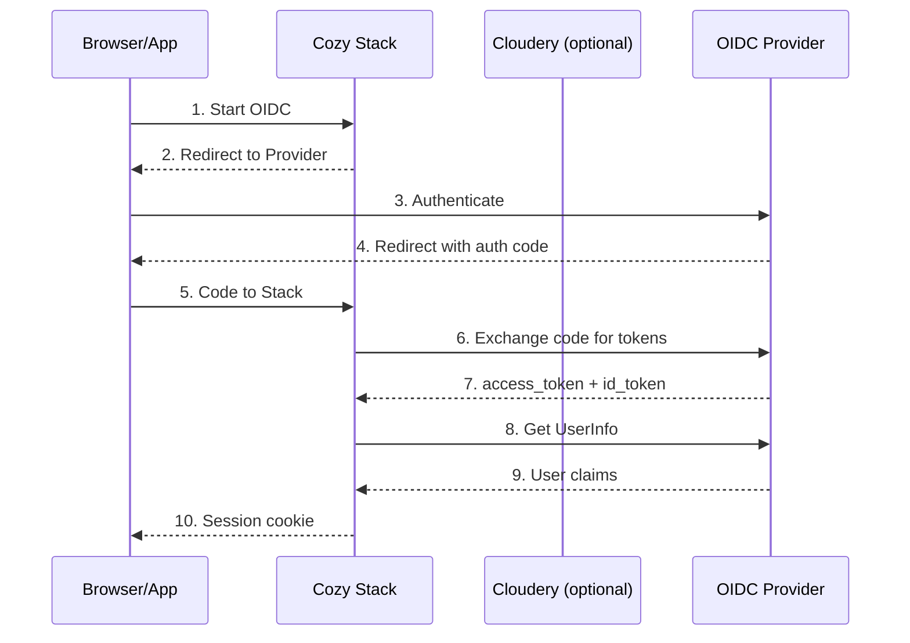
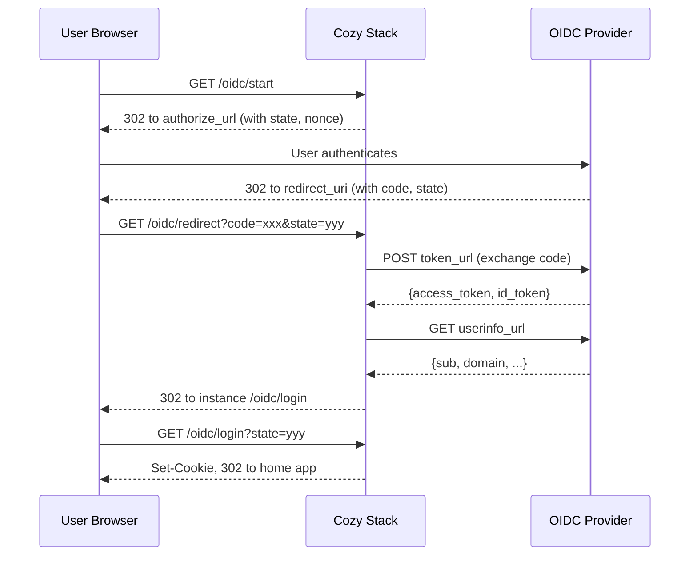
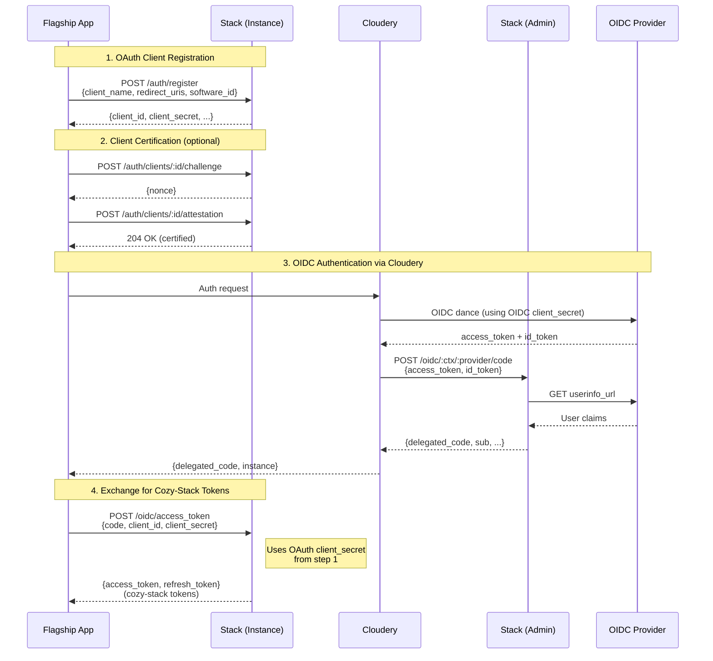
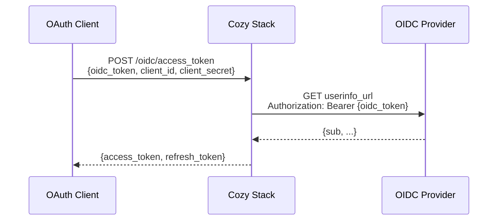
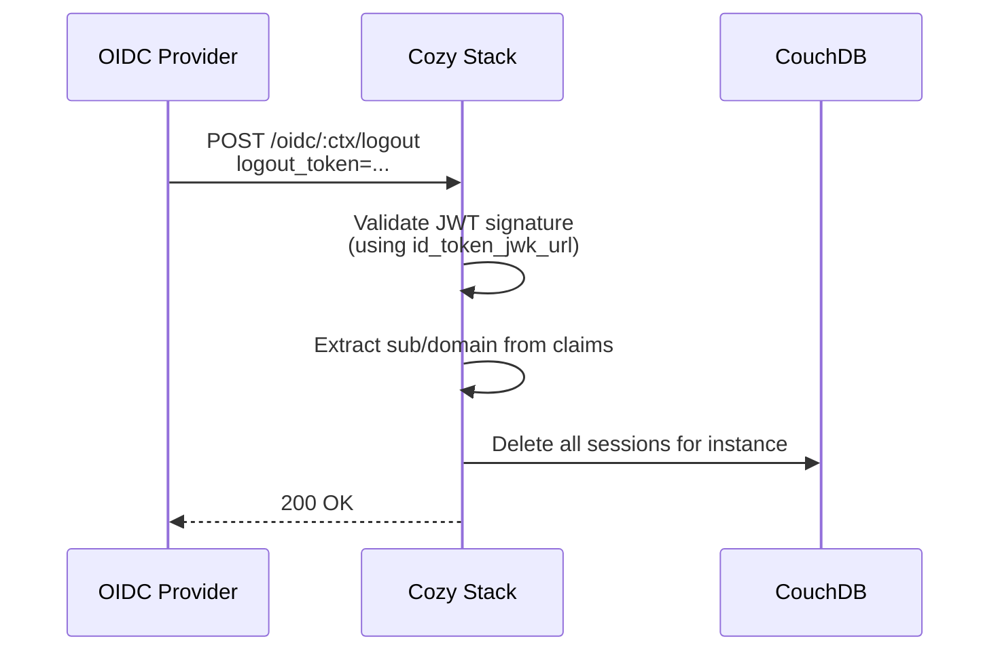
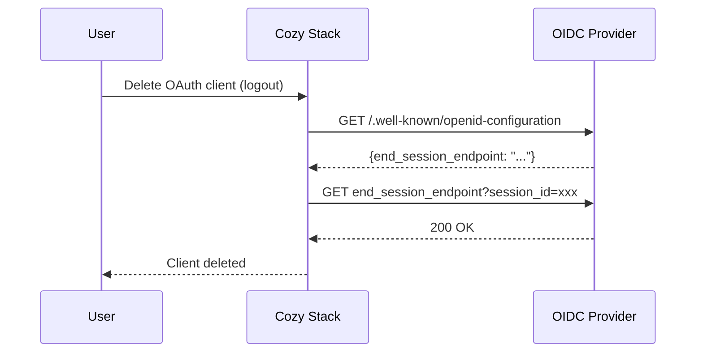

[Table of contents](README.md#table-of-contents)

# Delegated Authentication

In general, the cozy stack manages the authentication itself. In some cases, an
integration with other software can be mandatory. It's possible to use JWT or
OpenID Connect, with a bit of configuration to do that.

## Table of Contents

- [JWT Authentication](#jwt-authentication)
- [OpenID Connect](#openid-connect)
  - [Configuration](#configuration)
  - [Architecture Overview](#architecture-overview)
  - [Authentication Flows](#authentication-flows)
  - [Session Management](#session-management)
  - [Token Handling](#token-handling)
  - [Logout Mechanisms](#logout-mechanisms)
  - [Routes Reference](#routes-reference)
  - [Admin Routes](#admin-routes)
- [FranceConnect](#franceconnect)
- [Sharing with OIDC](#sharing-with-oidc)

---

## JWT Authentication

To enable an external system to create links with a JWT to log in users for
cozy instances in a given context, we just need to add the secret to use for
checking the JWT in the config, like this:

```yaml
authentication:
  the-context-name:
    jwt_secret: s3cr3t
```

The external system can then create a JWT, with the parameter `name` as the
instance domain, and send the user to `https://<instance>/?jwt=...`. The user
will be logged in, and redirected to its default application.

---

## OpenID Connect

OpenID Connect (OIDC) can be used for delegated authentication, and is more
adapted when the users don't always come from the authentication provider.
The stack supports generic OIDC providers (such as Keycloak, LemonLDAP, etc.)
and FranceConnect.

### Configuration

OIDC configuration is set per context. A context is a set of configuration
parameters and each Cozy instance belongs to one context.

```yaml
authentication:
  the-context-name:
    disable_password_authentication: false
    oidc:
      client_id: aClientID
      client_secret: s3cret3
      scope: openid profile
      login_domain: login.mycozy.cloud
      redirect_uri: https://oauthcallback.mycozy.cloud/oidc/redirect
      logout_url: https://identity-provider/logout
      authorize_url: https://identity-provider/path/to/authorize
      token_url: https://identity-provider/path/to/token
      userinfo_url: https://identity-provider/path/to/userinfo
      userinfo_instance_field: cozy_number
      userinfo_instance_prefix: name
      userinfo_instance_suffix: .mycozy.cloud
      allow_custom_instance: false
      allow_oauth_token: false
      id_token_jwk_url: https://identity-provider/path/to/jwk
```

#### Configuration Parameters

| Parameter | Required | Description |
|-----------|----------|-------------|
| `client_id` | Yes | OAuth client ID for talking to the identity provider |
| `client_secret` | Yes | OAuth client secret |
| `scope` | Yes | OAuth scope parameter (typically `openid profile`) |
| `redirect_uri` | Yes | Where the user will be redirected after login. Must be a static hostname, not a cozy instance hostname. Must be registered with the OIDC provider |
| `authorize_url` | Yes | Authorization endpoint URL (`authorization_endpoint` in OIDC discovery) |
| `token_url` | Yes | Token endpoint URL (`token_endpoint` in OIDC discovery) |
| `userinfo_url` | Yes | UserInfo endpoint URL (`userinfo_endpoint` in OIDC discovery) |
| `login_domain` | No | A domain not tied to an instance that allows login with OIDC |
| `logout_url` | No | URL to redirect the user after logout |
| `userinfo_instance_field` | No | JSON field in UserInfo response to determine the cozy instance |
| `userinfo_instance_prefix` | No | Prefix added before the userinfo field value |
| `userinfo_instance_suffix` | No | Suffix added after the userinfo field value |
| `allow_custom_instance` | No | If true, uses `sub` claim to match instance's `oidc_id` |
| `allow_oauth_token` | No | If true, enables `POST /oidc/access_token` route |
| `id_token_jwk_url` | No | URL to fetch JWK keys for validating ID tokens and logout tokens |

#### Context-level Parameters

| Parameter | Description |
|-----------|-------------|
| `disable_password_authentication` | If true, disables password login and forces OIDC |

#### Instance Identification

The stack determines which Cozy instance a user belongs to in two ways:

1. **UserInfo field mapping** (default): The stack reads `userinfo_instance_field`
   from the UserInfo response and constructs the domain as:
   `{prefix}{field_value}{suffix}`

   Example: If UserInfo returns `"cozy_number": "00001"` with prefix `name` and
   suffix `.mycozy.cloud`, the instance is `name00001.mycozy.cloud`.

2. **Custom instance mode** (`allow_custom_instance: true`): The stack matches
   the `sub` claim from UserInfo/ID token against the `oidc_id` field stored
   on the instance. The `userinfo_instance_*` and `login_domain` fields are
   ignored in this mode.

---

### Architecture Overview

The OIDC implementation involves several components:



#### Key Components

| Component | Description |
|-----------|-------------|
| **State Storage** | Stores OIDC state and nonce during the dance (Redis or in-memory) |
| **Delegated Code Storage** | Stores delegated codes for Cloudery/flagship flow (Redis or in-memory) |
| **Session** | CouchDB document with optional `sid` field from OIDC |
| **OAuth Client** | CouchDB document with optional `oidc_session_id` field |

#### State Storage

During the OIDC dance, the stack stores state information to prevent CSRF and
replay attacks:

- **Storage**: Redis (if configured) or in-memory
- **TTL**: 15 minutes
- **Contents**: instance domain, redirect URL, nonce, confirm flag, OIDC context, sharing info

#### Delegated Code Storage

For the Cloudery/flagship flow, the stack stores delegated codes:

- **Storage**: Redis (if configured) or in-memory
- **TTL**: 3 hours
- **Contents**: subject (`sub` or domain), session ID (`sid` from id_token)

---

### Authentication Flows

#### Flow 1: Web Browser Login

This is the standard OIDC Authorization Code flow for web browsers.



**State transitions:**

1. `/oidc/start` - Creates state holder, redirects to OIDC provider
2. `/oidc/redirect` - Validates state, exchanges code for tokens, extracts SID from id_token
3. `/oidc/login` - Creates session with SID, sets cookie

#### Flow 2: Flagship App via Cloudery

The flagship app uses the Cloudery as an intermediary to obtain a delegated code.
This flow involves two different `client_secret` values:

| Secret | Issued By | Used By | Purpose |
|--------|-----------|---------|---------|
| OIDC `client_secret` | OIDC Provider | Cloudery/Stack | Authenticate to OIDC provider |
| OAuth `client_secret` | Cozy-Stack | Flagship App | Authenticate to Cozy-Stack |



**Key points:**

- **Step 1**: Flagship registers as an OAuth client with cozy-stack and receives its own `client_id` and `client_secret`
- **Step 2**: Flagship optionally certifies itself via Play Integrity (Android) or AppAttest (iOS)
- **Step 3**: Cloudery performs the OIDC dance using the **OIDC provider's** credentials (from stack config)
- **Step 4**: Flagship exchanges the delegated code using its **own** `client_id` and `client_secret` (from step 1)
- The stack extracts the `sid` (session ID) from the id_token and stores it with the delegated code
- The `oidc_session_id` is stored on the OAuth client for logout purposes

#### Flow 3: Direct OIDC Token Exchange

When `allow_oauth_token` is enabled, clients can exchange an OIDC token directly
for cozy-stack tokens (without the Cloudery intermediary).



If `id_token_jwk_url` is configured, the client can send an `id_token` instead of
`oidc_token`. The stack validates the JWT signature using keys from the JWK URL.

---

### Session Management

#### Session Structure

When a user authenticates via OIDC, a session document is created in CouchDB:

```json
{
  "_id": "session-id",
  "_rev": "...",
  "created_at": "2024-01-15T10:00:00Z",
  "last_seen": "2024-01-15T10:00:00Z",
  "long_run": true,
  "sid": "oidc-session-id-from-id-token"
}
```

The `sid` field contains the session ID extracted from the OIDC provider's
`id_token` (the `sid` claim). This is used for back-channel logout.

#### Session ID Extraction

The stack extracts the `sid` claim from the id_token during:

1. **Web browser flow**: At `/oidc/redirect` when tokens are received
2. **Flagship flow**: Stored with the delegated code, retrieved at `/oidc/access_token`

The extraction parses the id_token JWT (without verification, as signature was
already verified) and reads the `sid` claim.

#### OAuth Client Session Tracking

For OAuth clients (like the flagship app), the session ID is also stored on
the client document:

```json
{
  "_id": "client-id",
  "client_name": "Cozy Flagship",
  "oidc_session_id": "oidc-session-id",
  ...
}
```

This enables calling the OIDC provider's `end_session_endpoint` when the user
logs out.

---

### Token Handling

#### Tokens from OIDC Provider

When the stack exchanges the authorization code at the token endpoint, it
receives:

| Token | Used For | Stored |
|-------|----------|--------|
| `access_token` | Calling UserInfo endpoint | No (used once, discarded) |
| `id_token` | Extracting `sid` for logout | No (only `sid` extracted) |
| `refresh_token` | Refreshing access_token | No (not captured) |
| `expires_in` | Token TTL | No (not captured) |

**Current limitation**: The stack only uses the OIDC access_token to fetch
UserInfo immediately, then discards it. The refresh_token and expires_in are
not captured or stored.

#### Tokens from Cozy Stack

After successful OIDC authentication, the stack issues its own tokens:

| Token | Audience | Validity |
|-------|----------|----------|
| Access token | `access` | 7 days |
| Refresh token | `refresh` | No expiration |

These are standard cozy-stack OAuth tokens (JWT format) and are independent
of the OIDC provider's tokens.

---

### Logout Mechanisms

The stack supports two logout mechanisms for OIDC:

#### 1. Back-Channel Logout (Provider → Stack)

The OIDC provider can notify the stack to terminate user sessions by calling
the back-channel logout endpoint.



**Current behavior**: The back-channel logout deletes ALL sessions for the
user's instance, not just the specific session. The `sid` claim in the
logout_token is not used for per-device logout.

**Logout token validation**:
- JWT signature verified using keys from `id_token_jwk_url`
- Keys are cached for 24 hours
- Extracts `sub` (for `allow_custom_instance`) or domain field from claims

#### 2. End-Session Logout (Stack → Provider)

When an OAuth client is deleted (e.g., user logs out of flagship app), the
stack calls the OIDC provider's `end_session_endpoint` to terminate the SSO
session.



**Implementation details**:
- Fetches OIDC configuration from `/.well-known/openid-configuration`
- Configuration is cached for 24 hours
- Calls `end_session_endpoint` with `session_id` parameter
- Best-effort: failures don't prevent client deletion
- Only triggered if `oidc_session_id` is set on the OAuth client

---

### Routes Reference

#### GET /oidc/start

To start the OpenID Connect dance, the user can go to this URL. It will
redirect him/her to the identity provider with the rights parameter. The user
will also be redirected here if they are not connected and that the password
authentication is disabled.

**Request:**
```http
GET /oidc/start HTTP/1.1
Host: name00001.mycozy.cloud
```

**Response:**
```http
HTTP/1.1 303 See Other
Location: https://identity-provider/authorize?response_type=code&state=9f6873dfce7d&scope=openid+profile&client_id=aClientID&nonce=94246498&redirect_uri=https://oauthcallback.mycozy.cloud/oidc/redirect
```

**Query parameters:**
- `redirect` - URL to redirect after login (optional)
- `confirm` - Confirmation token (optional)

#### GET /oidc/redirect

Callback endpoint for the OIDC provider. Handles the authorization code and
redirects to the user's instance.

**Request:**
```http
GET /oidc/redirect?state=9f6873dfce7d&code=ccd0032a HTTP/1.1
Host: oauthcallback.mycozy.cloud
```

**Response:**
```http
HTTP/1.1 303 See Other
Location: https://name00001.mycozy.cloud/oidc/login?state=9f6873dfce7d
```

**Processing:**
1. Validates state exists and hasn't expired
2. Exchanges code for tokens at token_url
3. Extracts SID from id_token
4. Fetches UserInfo to determine instance
5. Redirects to instance's `/oidc/login`

#### GET /oidc/login

Creates the session and sets cookies on the user's instance.

**Request:**
```http
GET /oidc/login?state=9f6873dfce7d HTTP/1.1
Host: name00001.mycozy.cloud
```

**Response:**
```http
HTTP/1.1 303 See Other
Set-Cookie: cozysessid=...; Path=/; Domain=.name00001.mycozy.cloud; HttpOnly; Secure
Location: https://name00001-home.mycozy.cloud/
```

**Alternative parameters:**
- `access_token` - OIDC access token (if `allow_oauth_token` is enabled)
- `id_token` - OIDC ID token (if `id_token_jwk_url` is configured)

#### POST /oidc/twofactor

If the instance is protected with two-factor authentication, the login
route will render an HTML page with JavaScript to check if the user has trusted
the device. And the JavaScript submit a form to this route. If the trusted
device token is set, a session will be created. Else, a mail with a code is
sent, and the user is redirected to a page where they can type the two-factor
code.

**Request:**
```http
POST /oidc/twofactor HTTP/1.1
Host: name00001.mycozy.cloud
Content-Type: application/x-www-form-urlencoded

trusted-device-token=xxx&access-token=yyy&redirect=&confirm=
```

**Response:**
```http
HTTP/1.1 303 See Other
Set-Cookie: ...
Location: https://name00001-home.mycozy.cloud/
```

If no trusted device token, sends a 2FA code by email and shows input form.

#### POST /oidc/access_token

Exchanges an OIDC token or delegated code for cozy-stack OAuth tokens.
Requires `allow_oauth_token: true` in configuration.

**Request with OIDC token:**
```http
POST /oidc/access_token HTTP/1.1
Host: name00001.mycozy.cloud
Content-Type: application/json

{
  "client_id": "55eda056e85468fdfe2c8440d4009cbe",
  "client_secret": "DttCGIUOTniVNkivR_CsZ_xRoME9gghN",
  "scope": "io.cozy.files io.cozy.photos.albums",
  "oidc_token": "769fa760-59de-11e9-a167-9bab3784e3e7"
}
```

**Request with delegated code (flagship):**
```http
POST /oidc/access_token HTTP/1.1
Host: name00001.mycozy.cloud
Content-Type: application/json

{
  "client_id": "55eda056e85468fdfe2c8440d4009cbe",
  "client_secret": "DttCGIUOTniVNkivR_CsZ_xRoME9gghN",
  "scope": "*",
  "code": "delegated-code-from-cloudery"
}
```

**Request with ID token:**
```http
POST /oidc/access_token HTTP/1.1
Host: name00001.mycozy.cloud
Content-Type: application/json

{
  "client_id": "55eda056e85468fdfe2c8440d4009cbe",
  "client_secret": "DttCGIUOTniVNkivR_CsZ_xRoME9gghN",
  "scope": "io.cozy.files",
  "id_token": "eyJhbGciOiJSUzI1NiIs..."
}
```

**Response:**
```http
HTTP/1.1 200 OK
Content-Type: application/json

{
  "access_token": "ooch1Yei",
  "token_type": "bearer",
  "refresh_token": "ui0Ohch8",
  "scope": "io.cozy.files io.cozy.photos.albums"
}
```

**2FA required response:**
```http
HTTP/1.1 403 Forbidden
Content-Type: application/json

{
  "error": "two factor needed",
  "two_factor_token": "123123123123"
}
```

Then retry with:
```json
{
  "client_id": "...",
  "client_secret": "...",
  "scope": "...",
  "oidc_token": "...",
  "two_factor_token": "123123123123",
  "two_factor_passcode": "678678"
}
```

**Flagship certification required response:**
```http
HTTP/1.1 202 Accepted
Content-Type: application/json

{
  "session_code": "ZmY4ODI3NGMtOTY1Yy0xMWVjLThkMDgtMmI5M2"
}
```

The `session_code` can be used in the OAuth authorize page query string.

#### POST /oidc/:context/logout

Back-channel logout endpoint called by the OIDC provider.

**Request:**
```http
POST /oidc/mycontext/logout HTTP/1.1
Host: oauthcallback.mycozy.cloud
Content-Type: application/x-www-form-urlencoded

logout_token=eyJhbGciOiJSUzI1NiIs...
```

**Response:**
```http
HTTP/1.1 200 OK
Cache-Control: no-store
```

**Error responses:**
- `400 Bad Request` - Invalid configuration, invalid token, or internal error

**Logout token requirements:**
- Must be a valid JWT signed with keys from `id_token_jwk_url`
- Must contain `sub` claim (for `allow_custom_instance`) or domain field

#### GET /oidc/bitwarden/:context

This route can be used by a bitwarden client to get a token from the OpenID
Connect Identity Provider, and the fqdn of the associated cozy instance. This
token can then be exchanged for credentials for the cozy instance.

**Request:**
```http
GET /oidc/bitwarden/mycontext?redirect_uri=cozypass://login HTTP/1.1
Host: oauthcallback.mycozy.cloud
```

**Response:**
```http
HTTP/1.1 303 See Other
Location: https://identity-provider/authorize?response_type=code&state=...
```

After OIDC completes:
```http
HTTP/1.1 303 See Other
Location: cozypass://login?code=xxx&instance=alice.example.com
```

#### POST /oidc/bitwarden/:context

Exchanges the Bitwarden code for credentials.

**Request:**
```http
POST /oidc/bitwarden/mycontext HTTP/1.1
Host: alice.example.com
Content-Type: application/x-www-form-urlencoded

code=xxx&password=myHashedPassword&client_id=mobile&deviceType=0&deviceIdentifier=aac2e34a-44db-42ab-a733-5322dd582c3d&deviceName=android&clientName=CozyPass
```

**Response:**
```http
HTTP/1.1 200 OK
Content-Type: application/json

{
  "client_id": "f05671e159450b44d5c78cebbd0260b5",
  "registration_access_token": "J9l-ZhwP...",
  "access_token": "eyJhbGciOiJSUzI1NiIs...",
  "expires_in": 3600,
  "token_type": "Bearer",
  "refresh_token": "28fb1911ef6db24025ce1bae5aa940e117eb09dfe609b425b69bff73d73c03bf",
  "Key": "0.uRcMe+Mc2nmOet4yWx9BwA==|...",
  "PrivateKey": null
}
```

#### GET /oidc/franceconnect

Starts the OIDC flow specifically for FranceConnect. See [FranceConnect](#franceconnect) section.

---

### Admin Routes

These routes are used by the Cloudery and require admin authentication.

#### POST /oidc/:context/:provider/code

Creates a delegated code for the flagship app. The Cloudery calls this after
completing the OIDC dance with the provider.

**Request:**
```http
POST /oidc/mycontext/oidc/code HTTP/1.1
Host: admin.cozy.example
Content-Type: application/json
Authorization: Bearer admin-token

{
  "access_token": "oidc-access-token",
  "id_token": "oidc-id-token"
}
```

**Response:**
```http
HTTP/1.1 200 OK
Content-Type: application/json

{
  "sub": "user-subject-id",
  "email": "user@example.com",
  "delegated_code": "abc123def456"
}
```

**Processing:**
1. Calls UserInfo endpoint with the access_token
2. Extracts `sid` from id_token (for logout support)
3. Creates delegated code with 3-hour TTL
4. Returns UserInfo claims plus delegated_code

The `:provider` parameter can be `oidc` or `franceconnect`.

---

## FranceConnect

FranceConnect is a French government OIDC provider. It works similarly to
generic OIDC but has a dedicated configuration section and login flow.

### Configuration

```yaml
authentication:
  the-context-name:
    franceconnect:
      client_id: aClientID
      client_secret: s3cret3
      scope: openid email
      redirect_uri: https://oauthcallback.mycozy.cloud/oidc/redirect
      authorize_url: https://identity-provider/path/to/authorize
      token_url: https://identity-provider/path/to/token
      userinfo_url: https://identity-provider/path/to/userinfo
```

The last 3 URLs can be omitted for production (defaults to FranceConnect
production URLs).

### Differences from Generic OIDC

| Aspect | Generic OIDC | FranceConnect |
|--------|--------------|---------------|
| Start route | `GET /oidc/start` | `GET /oidc/franceconnect` |
| Login UI | Standard OIDC button | FranceConnect branded button |
| Token request | Basic auth header | Client credentials in body |
| Instance matching | `oidc_id` field | `franceconnect_id` field |
| Nonce validation | Optional | Required |

### Instance Matching

For FranceConnect, the instance's `franceconnect_id` field is matched against
the `sub` claim (instead of `oidc_id` for generic OIDC).

---

## Sharing with OIDC

OIDC can be used during the sharing flow to authenticate users accepting shares.

### Routes

#### GET /oidc/sharing

Starts OIDC authentication for a sharing flow. Used when the recipient needs
to authenticate to accept a share.

**Query parameters:**
- `sharing_id` - ID of the sharing
- `state` - Sharing state token

#### GET /oidc/sharing/public

Similar to above but for public sharing links that require OIDC authentication.
