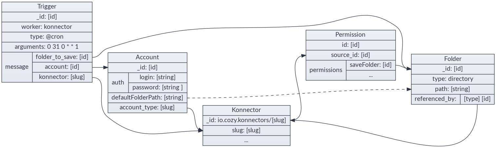

# Konnectors workflow

## TL;DR





## Types

### Accounts

`io.cozy.accounts` contains information for an account, including those for
authentication (technically, they are encrypted by cozy-stack before being
saved in CouchDB, but we will show them as the konnectors will see them):

```json
{
    "auth": {
        "login": "000000000",
        "password": "**********"
    },
    "folderPath": "/Administratif/Free Mobile",
    "label": "freemobile",
    "namePath": "Free Mobile"
}
```

Accounts are manipulated through the `/data/` API.

#### Aggregator accounts

Some konnectors are based on an aggregator service. An aggregator is declared
in the konnector manifest and specify an `accountId` property. When Cozy-Home
detects this property, it checks if an account with this given id exists. If not,
it creates it. Every account created for a konnector based on an aggregator is
then related to this aggregator account. This relationship is called `parent`
account.

```json
{
    "auth": {
        "login": "000000000",
        "password": "**********"
    },
    "folderPath": "/Administratif/Bankbank",
    "label": "Bankbank",
    "namePath": "Bankbank",
    "relationships": {
      "parent": {
        "_id": "service-aggregator-account",
        "_type": "io.cozy.accounts"
      }
    }
}
```

**Note:** you can read more about the [accounts doctype
here](https://docs.cozy.io/en/cozy-doctypes/docs/io.cozy.accounts/).

### Konnectors

`io.cozy.konnectors` are installed similarly to `io.cozy.apps` (see
[doc](./konnectors.md))

### Permissions

Like client-side applications, each konnector has an associated
`io.cozy.permissions`. These permissions are those listed on the manifest of
the konnectors, and the stack will add a permission for the files on the folder
choosen by the user.

### Triggers

`io.cozy.triggers` are used to define when konnectors are launched. See
https://docs.cozy.io/en/cozy-stack/jobs/#post-jobstriggers


## Complete flow example

As a user, from the expenses management app, I have a clean flow to configure a
connector to retrieve my travel expenses

1 - User is in **my-expenses** and clicks on \[configure travels\]

2 - **my-expenses** triggers an intent

```javascript
cozy.intents.start("CREATE", "io.cozy.konnectors", {
    category: "transport"
});
```

3 - the Store app catch the intent, fetch all available konnectors and let the
user choose

```http
GET /registry?... HTTP/1.1
```

4 - the user chooses the trainline konnector. Its manifest looks like this:

```json
{
    "name": "Trainline",
    "type": "konnector",
    "slug": "konnector-trainline",
    "description": "Konnector for trainline . com",
    "source": "https://github.com/konnectors/trainlines.git@build",
    "developer": {
        "name": "XXX",
        "url": "https://www.xxx.fr"
    },
    "version": "3.0.0",
    "licence": "AGPL-3.0",
    "fields": {
        "login": {
            "type": "text"
        },
        "password": {
            "type": "password"
        },
        "advancedFields": {
            "folderPath": {
                "advanced": true,
                "isRequired": false
            }
        }
    },
    "category": "transport",
    "frequency": "weekly",
    "permissions": {
        "events": {
            "description": "Connect train bill with  event in your calendar",
            "type": "io.cozy.events",
            "verbs": ["PATCH"]
        }
    }
}
```

5 - the user clicks on install, and the install starts:

```http
POST /konnectors/trainline HTTP/1.1
```

6 - the Store then uses an intent to know which app can configure this konnector:

```javascript
cozy.intents.start("REDIRECT", "io.cozy.accounts", {
    slug: "trainline"
});
```

7 - the Store redirects to the Home. The Home asks the user for account config
and create a folder to save the PDFs.

8 - the Home also add a Reference from the konnector to the folder to prevent
any accidental folder deletion:

```http
POST /files/123-selected-folder-id-123/relationships/referenced_by
```

```json
{
    "data": [
        {
            "type": "io.cozy.konnectors",
            "id": "io.cozy.konnectors/trainlines"
        }
    ]
}
```

9 - then the Home can create the account:

```http
POST /data/io.cozy.accounts HTTP/1.1
```

```json
{
    "account_type": "trainline",
    "auth": {
        "login": "xxxx",
        "password": "yyyyy"
    },
    "folderPath": "/Administrative/Trainline"
}
```

```http
HTTP/1.1 200 OK
```

```json
{
    "_id": "123-account-id-123",
    "_rev": "1-asasasasa",
    "account_type": "trainline",
    "auth": {
        "login": "xxxx",
    },
    "folderPath": "/Administrative/Trainline"
}
```

10 - the Home create the trigger:

```http
POST /jobs/io.cozy.triggers
```

```json
{
    "data": {
        "attributes": {
            "type": "@cron",
            "arguments": "0 0 0 0 1 1 ",
            "worker": "konnector",
            "message": {
                "konnector": "trainline",
                "account": "5165621628784562148955",
                "folder_to_save": "877854878455"
            }
        }
    }
}
```

11 - and, finally, the Home runs the konnector for the first time:

```http
POST /jobs/triggers/abc159753/launch HTTP/1.1
```

12 - the Home uses the [realtime](./realtime.md) to be informed if the
konnector fails to login or succeeds to import the PDFs.

If the user wants to use several account, the Home can setup several triggers
for the same konnector & various accounts.


## Konnector Worker specs

### Prepare the execution

The cozy-stack prepares the execution of the konnector by doing these steps:

- it checks that the konnector is not in maintenance in the registry (execpt
  for manual execution)
- it ensures that the konnector has a folder where it can write its files,
  and has the permission to write in this folder.

### Execute the konnector

Start the konnector through nsjail, passing as ENV variables :

    - `COZY_URL`:          the starting instance URL
    - `COZY_CREDENTIALS`:  security token to communicate with Cozy
    - `COZY_FIELDS`:       JSON-encoded message with the arguments from the trigger
    - `COZY_PARAMETERS`:   JSON-encoded parameters from the konnector manifest
    - `COZY_LANGUAGE`:     the language field of the konnector (eg. "node" etc.)
    - `COZY_LOCALE`:       the locale of the user (eg. "en" etc.)
    - `COZY_TIME_LIMIT`:   how much time the konnector can run before being killed
    - `COZY_JOB_ID`:       id of the job
    - `COZY_JOB_MANUAL_EXECUTION`: whether the job was started manually (in Home) or automatically (via a cron trigger or event)

The konnector process can send events trough its stdout (newline separated JSON
object), the konnector worker pass these events to the realtime hub as
`io.cozy.jobs.events`.

-   Only JSON formatted events are forwarded to the client-side throught
    realtime
-   Otherwise formatted lines (such as node Error) will be kept in some system
    logs.

Konnectors should NOT log the received account login values in production.

### Konnector error handling

The konnector can output json formated messages as stated before (the events)
and those events will be typed and formatted like this:

```javascript
{
    type: "messagetype",  // can be "debug", "info", "warning", "error", and "critical"
    message: "message"    // can be any string
}
```

If there is an error or critical message, the execution will be seen as a
failure by cozy-stack. It's also the case if the konnector reaches the timeout
or returns with a non-zero status code.

**Note:** debug and info level are not transmitted to syslog, except if the
instance is in debug mode. It would be too verbose to do otherwise.

### Account deleted

When an account is deleted, or a konnector is going to be uninstalled, the
konnector is executed with the `account_deleted` field to true, so it can clean
the account remotely.


## OAuth (and service secrets)

### Doctypes

`io.cozy.konnectors` gives their desiderata for an account

```json
{
    "fields": {
        "account": {
            "doctype": "io.cozy.accounts",
            "account_type": "maif",
            "scope": "openid profile offline_access"
        }
    }
}
```

`io.cozy.accounts` contains authentication information for an account, as well
as the associated scope

```json
{
    "name": "Mon Compte Maif",
    "account_type": "maif",
    "status": "connected",
    "oauth": {
        "access_token": "akosaksoakso",
        "refresh_token": "okoakozkaozk",
        "scope": "openid profile offline_access"
    }
}
```

`io.cozy.account_types` contains the oauth configuration:

```json
{
    "_id": "service.example",
    "grant_mode": "authorization_code",
    "client_id": "the registered client id",
    "client_secret": "client_secret is necessary for server-flow",
    "auth_endpoint": "https://service.example/auth",
    "token_endpoint": "https://api.service.example/token"
}
```

`io.cozy.account_types` are not accessible to the applications: they are
injected directly in CouchDB in a global database
`secrets/io-cozy-accounts_type`.

### Secrets that are not OAuth

The `io.cozy.account_types` doctype can also be used for storing secrets that
are not related to OAuth. The document still need to be injected manually in
`secrets/io-cozy-accounts_type`:

```
{
    "_id": "service.example",
    "grant_mode": "secret",
    "slug": "service",
    "secret": "th1$_1$_th3_s3cr3t!"
}
```

**Note**: `grant_mode` must be `secret`, `slug` must be the slug of the
konnector,  but `secret` can be a map instead of a simple string if several
secrets are needed for this service.

The secret is given to the konnector in the `COZY_PARAMETERS` env variable.


### Reminder OAuth flow

**Service** is the website from which konnector aims to retrieve informations.
**Stack** is the cozy stack.

OAuth is divided in 3 steps:

-   Client Registration: the client application (the Stack) needs to be
    registered with the Service
-   Obtaining & Refreshing Authorization: all the steps from `client_id` to
    `access_token`, the Stack will handle those
-   Using the `access_token`: ideally, the konnector should only concern itself
    with this part; it receives an `access_token` and uses it.

#### Client Registration

Before beginning the Grant process, most Services require the application to be
registered with a defined `redirect_uri`.

There are a lot of options, which we will choose from when actually
implementing konnectors using them.

### Manually

Most services requires a human developer to create the client manually and
define its redirect_uri. However each instance has its own domain, so for these
services, we will need to:

**A. Register a "proxy" client**, which is a static page performing redirections
as needed, as was done for Facebook events in v2 konnectors. We will register a
well known cozy domain, like `oauth-proxy.cozy.io` and registers it with all
providers. The use and risks associated with this domain should be made clear to
the user.

**B. Register each Stack** with a redirect_uri on the main stack domain, if we
go this way, the register_uri below moves from
`bob.cozy.rocks/accounts/redirect` to `oauthcallback.cozy.rocks/redirect` and the
domain will be prepended to the state. This is feasible at cozy scale, but
requires more knowledge and work for self-hosters.

#### Example: Google

For example, these are the steps for creating the google `account_type` for the
stack at .mycozy.cloud:

-   Go to https://console.developers.google.com
-   Select or Create Project (up left near the logo)
-   Enable desired APIs (TBD with usages)
-   Click "Credentials"
-   Create credentials > Oauth Client ID > Web application
-   Set redirectURI to
    https://oauthcallback.mycozy.cloud/accounts/google/redirect
-   Copy and paste provided Client ID and Client Secret.

Then save the data in the console

```
http PUT localhost:5984/secrets%2Fio-cozy-account_types/google
grant_mode=authorization_code
redirect_uri="https://oauthcallback.mycozy.cloud/accounts/google/redirect"
token_mode=basic
token_endpoint="https://www.googleapis.com/oauth2/v4/token"
auth_endpoint="https://accounts.google.com/o/oauth2/v2/auth"
client_id=$CLIENT_ID
client_secret=$CLIENT_SECRET
```

#### Dynamic Registration Protocol

A few services allows client to register programaticaly through the Dynamic
Client Registration Protocol [RFC7591](https://tools.ietf.org/html/rfc7591), we
should allow the Stack to register using this protocol when we first need to
implement a Konnector connecting to such a Service.

#### No redirect_url enforcement

A few services allows to specify arbitrary redirect_url without registering
beforehand as a client.

### Authorization Grant flows

#### webserver flow (Authorization Code Grant)

A. In the cozy app (Home) give a link

```html
<a href="https://bob.cozy.rocks/accounts/service-name/start?
  scope=photos&
  state=1234zyx">
```

**NOTE** the scope may depends on other fields being configured (checkboxes),
this will be described in json in the konnectors manifest. The format will be
determined upon implementation.

**NOTE** To limit bandwidth and risk of state corruption, the cozy app should
save its state under a random key into localStorage, the key is then passed as
the state in this query.

B. Service lets the user login, allows or denies the scope, then redirects to

```http
https://oauthcallback.cozy.rocks/accounts/service-name/redirect?
  code=AUTH_CODE_HERE&
  state=1234zyx
```

C. The Stack does Server side this request:

```http
POST https://api.service.example/oauth/access_token HTTP/1.1
Content-Type: application/x-www-form-urlencoded

grant_type=authorization_code&
  code=AUTH_CODE_HERE&
  redirect_uri=https://oauthcallback.cozy.rocks/accounts/service-name/redirect&
  client_id=CLIENT_ID&
  client_secret=CLIENT_SECRET
```

D. The Service responds (server side) with:

```json
{
    "access_token": "ACCESS_TOKEN",
    "token_type": "bearer",
    "expires_in": 2592000,
    "refresh_token": "REFRESH_TOKEN",
    "scope": "read",
    "uid": 100101,
    "info": {
        "name": "Claude Douillet",
        "email": "claude.douillet@example.com"
    }
}
```

This whole object is saved as-is into a `io.cozy.accounts` 's `extras` field.

The known fields `access_token`, `refresh_token` & `scope` will be **also**
saved on the account's `oauth` itself

E. The Stack redirect the user to the cozy app:

```http
HTTP/1.1 302 Found
Location: https://bob-home.cozy.rocks/?state=1234zyx&account=accountID
```

The Cozy app checks that the state is expected, and restores its state to the
form but whith account completed.

#### SPA flow (Implicit grant)

A. The cozy app gives a link:

```html
<a href="https://service.example/auth? (url)
    response_type=token&
    client_id=CLIENT_ID&
    redirect_uri=https://bob-home.cozy.rocks/&
    scope=photos&
    state=1234zyx">
```

See server-flow for state rules.

B. Service lets the user login, allows or denies the scope, then redirects to

```http
https://bob-home.cozy.rocks/?
access_token=ACCESS_TOKEN&
state=1234zyx
```

C. The Cozy app adds the token to the `io.cozy.accounts` and save it before
starting konnector.

### Accessing data

Once we have an account, the Cozy app starts the konnector with the proper
account id. The konnector can then fetch the account and use its `access_token`
to performs a request to fetch data:

```http
POST https://api.service.com/resource HTTP/1.1
Authorization: Bearer ACCESS_TOKEN
```

### Refreshing token

When using the server-flow, we also get a refresh_token. It is used to get a new
access_token when it expires. However, if konnectors are responsible for
refreshing token there is a race condition risk :

```
(konnector A) GET  https://api.service.com/resource TOKEN1     -> expired
(konnector B) GET  https://api.service.com/resource TOKEN1     -> expired
(konnector A) POST https://api.service.com/token REFRESH_TOKEN -> TOKEN2a
(konnector B) POST https://api.service.com/token REFRESH_TOKEN -> TOKEN2b
(konnector A) GET  https://api.service.com/token TOKEN2a       -> invalid
```

To avoid this, the stack will be responsible to perform token refresh. A
konnector can requires the stack to refresh an account token with an HTTP
request.

```http
POST https://bob.cozy.rocks/accounts/:accountID/refresh HTTP/1.1
```

### Konnectors Marketplace Requirements

The following is a few points to be careful for in konnectors when we start
allowing non-cozy developped OAuth konnectors.

-   With SPA flow, because of advanced security concerns (confused deputy
    problem), cozy should validate the `access_token`. However, the way to do
    that depends on the provider and cannot be described in json, it is
    therefore the responsibility of the konnector itself.

### Account types security rules

-   With server flow, an evil account type with proper `auth_endpoint` but bad
    `token_endpoint` could retrieve a valid token as well as cozy client secret.
    The reviewer of an `account_type` should make sure both these endpoints are
    on domains belonging to the Service provider.

### Notes for MesInfos experiment

-   MAIF konnector uses the webserver flow without redirect_uri validation
-   Orange konnector uses the client-side proxy but hosted on their own servers
    (/!\ redirect_uri vs redirect_url)
