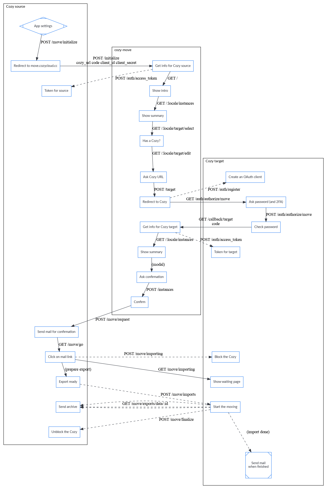
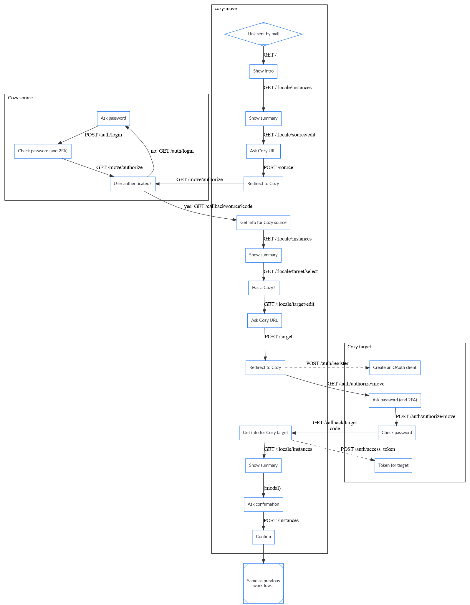

[Table of contents](README.md#table-of-contents)

# Move design

> "You will stay because you can leave" - Cozy.

We have made this important promise to our users, and moving a Cozy to a new
hoster/address is a big part of it. That's why we have tried hard to make it
smooth and robust. It means that we had to manage some complex special cases.
This document is here to keep a trace of them.

But, first, let's define what moving a Cozy means. When you have an instance,
the "source", and another instance, the "target", the user can move their usage
from the source to the target. The data is exported from the source instance,
and imported on the target instance. But there is more than that. For example,
the Cozy to Cozy sharings will be updated to work the target instance instead
of the source instance.

## Workflows

Technically, a new component called [Cozy-Move](https://github.com/cozy/cozy-move)
was created. It is a web application in Elixir/Phoenix that can be seen as a
wizard to help users select from which instance and to which instance they want
to move. It is possible to send a mail with a link to cozy-move, and put this
link in a FAQ, and users can start the process from this link. But, if a user
wants to initiate a move by them-self, they will start from the settings of
their Cozy. The two workflows are available.

### Starting from settings

### Starting from cozy-move

### Notes

For security, we need an interaction of the user with both instances (even if
the user is already logged). There is a confirmation mail sent by the source
Cozy, that counts as a interaction. For the target Cozy, a click on a page
served by the stack could have been enough, but asking the password was easier
to explain to the user and improve the sense of security as perceived by the
user, so that was what we did. And we had to take care of that to allow or
forbid swapping instances on Cozy-Move.

The token exchanges are inspired by OAuth 2.0, but don't follow OAuth 2.0 as it
would have made the user experience really awkwards with lots of redirections
and meaningless screens. The confirmation mail is really important, as it is
a safeguard if the worflows are not as robust as I think they are.

## Source instance

Exporting the data from a Cozy was a feature already implemented in the stack.
The user can ask an export of their Cozy: the stack will send a mail with a
link, and after the following the link, the user can download the data as a
zip. If the VFS takes a lot of space, the zip will be split in several
parts.

When an export if part of a move, the instance is blocked to avoid any change
that could increase the risk of inconsistencies during the move.

And, if the move is successful, the OAuth clients are revoked to encourage the
user to reconnect them on the target. Also, the source instance will be
destroyed 30 days later. It gives time to the user to check that every thing is
OK on their new instance, and can be used to alert other users that want to see
a page shared by link of the new address of the sharing.

### Zip vs Tar

The export produces a zip file (or several files if it is too large). But the
stack first makes a tar file while preparing the export. At first, it looks
strange, but we though that a zip will be more friendly for users, and a tar is
more adapted to our constraints. A tar can be read sequentially while a zip
needs random access, and it was easier to stream a tar from Swift and converts
it to zip, than trying to add entries to a zip file (and we didn't want to copy
the whole files from the VFS in the zip in Swift as it takes too much space).

## Target instance

Importing a zip can also be done before moving: the user can go in the settings
of their Cozy, gives the URL of the zip, and let the Cozy imports it. The Cozy
is reset before the import: the data is erased!

We would like to offer a way to merge the existing data and the data to import,
but it looks really complex and we think that it is more useful to use our time
on other features.

At the end of the import, a mail is sent to the user to tell them that they can
use again their Cozy (the instance is blocked during the reset+import).

## Special doctypes

### Apps

The home, settings, and store applications are always installed on the target Cozy.
And we also try to install all the webapps and konnectors from the source, but
it can fail as they might not be available (e.g. the 2 Cozys don't have the
same apps registry). In that case, the user will be alerted in the mail sent at the
end of the import.

For the permissions, we recreate them from the manifest and don't try to import them
from the source instance.

### Email address

The email address on the target instance is kept. We don't import the email
address the user had on their source instance. The stack also keep other
settings that are tied to the cloudery (UUID, ToS, context).

We also update the myself document with the kept email address.

### Files

The directories, files, and versions are imported. The thumbnails are not
exported/imported, but rebuilt on the target instance.

If the quota of the target is too small for the files from the source, we alert
the user before the move.

### Konnectors

See the apps section. For konnectors that have a on_delete_accounts hook, we have
to use some tricks:

- we delete the accounts on the target instance for the reset while the
  instance is blocked, but the konnectors can still make requests to the stack
  for those executions (allowed via a flag in redis)
- the accounts from the source instance are not imported on the target, as they
  will be useless soon (when they will be deleted by the source).

### Sessions

They are not imported.

### Sharings

For the shared by links, we import the permission document. But the link given
to other users will still go on the old instance. While this instance is not
deleted, it will show a page that gives the new link.

For the Cozy to Cozy sharings, the stack has a mechanism for updating them so
that the other instances will now synchronize with the target. It is a bit
complicated as we have to make it work if several members of a sharing has
moving at the same time, and as the JWT tokens are tied to an instance and have
to be renewed (access token & refresh token).

### Triggers

We import the triggers for the sharings and konnectors. For the apps
(services), they are recreated when installed. The trigger for the
thumbnails is also recreated when the instance is reset (not imported).

Note: the triggers are imported at the end to avoid creating many jobs when
importing the shared files.

### Vault

The bitwarden vault is encrypted with a key not available on the servers (on
purpose). It makes difficult to move it automatically, but the stack can detect
if the vault has been used, and in that case, show instructions to export and
import the passwords.
