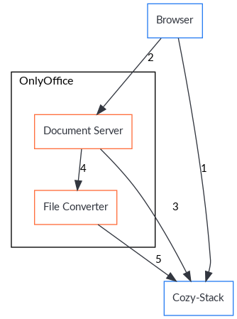

[Table of contents](README.md#table-of-contents)

# Collaborative edition of Office documents

## Diagrams

### Opening a document with OnlyOffice

Reference: https://api.onlyoffice.com/editors/open



1. The browser makes a request `GET /office/:id/open` to know the address of the OnlyOffice server
2. The browser makes several HTTP requests to the Document Server
    1. Fetch the `api.js` script
    2. Open a websocket connection
    3. Send a command to load the office document
3. The document server makes a request to the [callback URL](https://api.onlyoffice.com/editors/callback#status-1) with `status=1`
4. The document server asks the file converter to load the document (via RabbitMQ?)
5. The file converter loads the file content from the stack

## Routes

### GET /office/:id/open

This route returns the parameters to open an office document. There are two
cases:

1. The document is shared and should be opened on another instance (for
   collaborative edition)
2. The document can be opened locally.

In the first case, the response will contain the parameters of the other
instance. In the second case, the parameters are for the document server of
OnlyOffice.

If the identifier doesn't give an office document or if there is no onlyoffice
server configured, the response will be a `404 Page not found`.

#### Request

```http
GET /office/32e07d806f9b0139c541543d7eb8149c/open HTTP/1.1
Host: bob.cozy.example
```

#### Response (case 1)

```http
HTTP/1.1 200 OK
Content-Type: application/vnd.api+json
```

```json
{
  "data": {
    "type": "io.cozy.office.url",
    "id": "32e07d806f9b0139c541543d7eb8149c",
    "attributes": {
      "document_id": "b05e7c306f9c0139c542543d7eb8149c",
      "subdomain": "flat",
      "protocol": "https",
      "instance": "alice.cozy.example",
      "sharecode": "543d7eb8149c",
      "public_name": "Bob"
    }
  }
}
```

#### Response (case 2)

```http
HTTP/1.1 200 OK
Content-Type: application/vnd.api+json
```

```json
{
  "data": {
    "type": "io.cozy.office.url",
    "id": "32e07d806f9b0139c541543d7eb8149c",
    "attributes": {
      "document_id": "32e07d806f9b0139c541543d7eb8149c",
      "subdomain": "flat",
      "protocol": "https",
      "instance": "bob.cozy.example",
      "public_name": "Bob",
      "onlyoffice": {
        "url": "https://documentserver/",
        "token": "eyJhbGciOiJIUzI1NiIsInR5cCI6IkpXVCJ9.e30.t-IDcSemACt8x4iTMCda8Yhe3iZaWbvV5XKSTbuAn0M",
        "documentType": "word",
        "document": {
          "filetype": "docx",
          "key": "7c7ccc2e7137ba774b7e44de",
          "title": "Letter.docx",
          "url": "https://bob.cozy.example/files/downloads/735e6cf69af2db82/Letter.docx?Dl=1",
          "info": {
            "owner": "Bob",
            "uploaded": "2010-07-07 3:46 PM"
          }
        },
        "editor": {
          "callbackUrl": "https://bob.cozy.example/office/32e07d806f9b0139c541543d7eb8149c/callback",
          "lang": "en",
          "mode": "edit"
        }
      }
    }
  }
}
```

### POST /office/callback

This is the callback handler for OnlyOffice. It is called when the document
server wants to save the file.

See https://api.onlyoffice.com/editors/callback

#### Request

```http
POST /office/callback HTTP/1.1
Host: bob.cozy.example
Content-Type: application/json
```

```json
{
    "actions": [{"type": 0, "userid": "78e1e841"}],
    "changesurl": "https://documentserver/url-to-changes.zip",
    "key": "7c7ccc2e7137ba774b7e44de",
    "status": 2,
    "url": "https://documentserver/url-to-edited-document.docx",
    "users": ["6d5a81d0"]
}
```

#### Response

```http
HTTP/1.1 200 OK
Content-Type: application/json
```

```json
{ "error": 0 }
```
