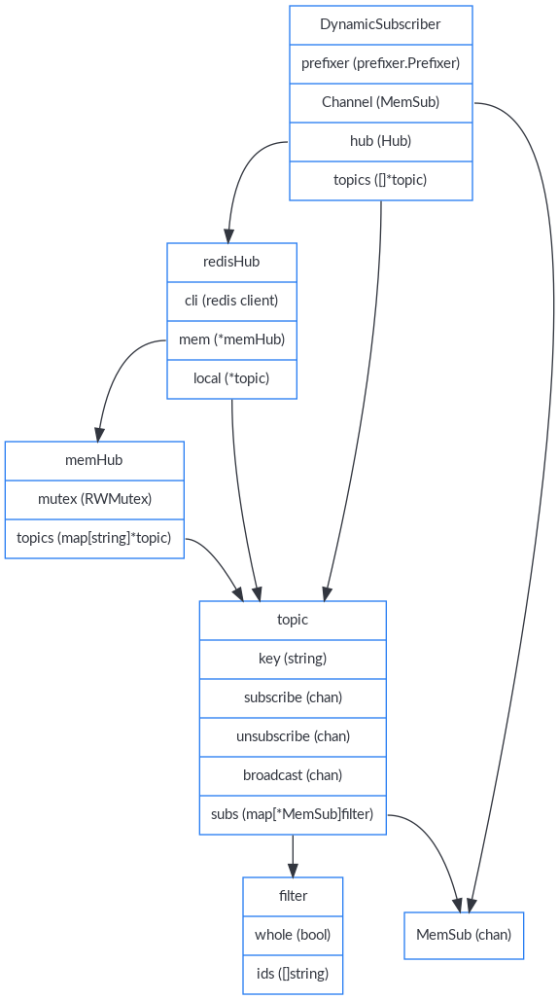
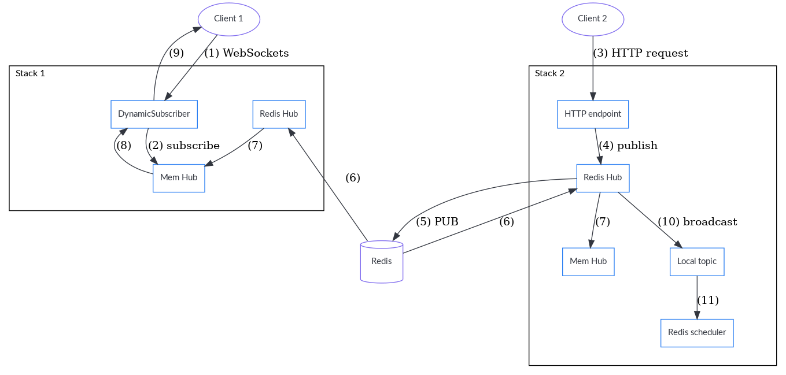

[Table of contents](README.md#table-of-contents)

# Realtime internals

The stack has a realtime package, which can be seen as a pub/sub of events.
Most events are created by the CouchDB package when a document is created,
updated or deleted, but there are also some synthetic events like the end of
the initial synchronization of a Cozy to Cozy sharing. Those events can be
sent via the realtime websockets to clients and can be used by the scheduler
to fire triggers.

There are two versions of the Hub implementation: an in-memory one, and a redis
one. The in-memory one is used by the developers and the self-hosted instances.
The redis one is used when there are several stacks, to send the events from
one stack to the others, and then use the in-memory hub internally.

## Model

Let's start by the most basic unit. The EventsChan is go channel for sending
events.

Then, we have the topic. There is one topic per doctype of an instance if
there is at least one subscriber for it. It receives events via its
`broadcast` channel.

The mem hub is where the stack keeps the list of topics. There is a mutex to
protect against race conditions (a sync.Map is not enough, as we also need to
initialize topics).

The redis hub is here to ensure that each stack can publish the events in its
own mem hub. It also has the concept of "firehose": it is a special topic where
every events created on this stack are published. It is used by the scheduler
for the events trigger. The mem hub is not used for that, as we don't want to
fire the same triggers n times (one on each stack), but only once.

And then, we have the subscribers. A subscriber is used to receive events. It
is tied to an instance (via the prefixer) and can subscribes to doctypes. With
the instance + doctype, the hub can find the right topic, and adds the
subscriber to the `subs` map of the topic. We have the notion of filter because
the subscriber may want to receive the events for the whole doctype (subscribe)
or just for some identifiers (watch).

## Workflow of a realtime event (redis hub)

1. A client connects to the realtime websocket and subscribe to some doctypes
2. The stack creates a Subscriber for it and connects it to the mem hub.
3. Another client sends an HTTP request, which is makes a CouchDB write
4. This create an event to publish on the redis hub
5. The event is sent to redis (PUB command)
6. Each stack listens to redis and receive this event
7. The redis hub send the event to the mem hub
8. The mem hub finds the topic for this event, sees that there is subscriber for it, and forward it the event
9. The subscriber sends the event to the client
10. The redis hub also send the event to the firehose topic (only on the stack where the event was created)
11. The redis scheduler is listening to the broadcast and receive the events
12. With this event, the redis scheduler can look at the matching triggers, and fire them
