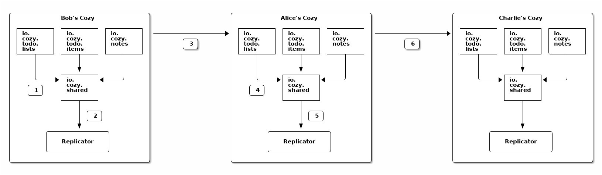

# Request for comments about the sharings

## Hypothesis

1. A sharer may not know the adresses of the recipients' cozy instances, but
he/she has a way to send them an URL on his/her cozy to start the process.
2. A user can preview a sharing before accepting it if the application
supports this option. Else, he/she will have only the description and rules to
make his/her mind about accepting or refusing the sharing.
3. The data is duplicated: it is both on the owner's cozy, and on the
recipients' cozy (no cloud federation like NextCloud).
4. The applications say what is shared, the stack synchronizes that. The stack
does the low-level stuff and gives primitives to the applications. The
applications must use them in a responsible manner, and in particular, to
avoid transitivity issues.
5. The CouchDB replication will be used to synchronize the documents. It means
that the documents will be same on the owner and on the recipients ("symetric
sharing").
6. For files and folders, the replicator will be customized to handle the
specificities of the `io.cozy.files` doctype.
7. The applications must be able to work with broken relationships between
documents.
8. The applications should know how to deal with CouchDB conflicts. At least,
the default choice of a winner for conflicts by CouchDB should be acceptable
if the applications don't do anything to detect and resolve conflicts.
9. First safety principle: when a user B accepts a sharing from user A, the
documents that were on the user B's cozy before the sharing are not sent to
user A without an explicit action of user B (like moving a file to a shared
directory).
10. Second safety principle: when two users, A and B, are sharing documents,
a change of a document on the user A's cozy can't make an exiting document of
user B enter in the sharing.

## Setup of a sharing

### Step 1: the owner creates the sharing

One person decides to share something with other people from an application on
her cozy. In our example, Alice wants to share a todo list with her friends, Bob
and Charlie, and it is done from the _Todo_ application. The application calls
the stack with the rules for this sharing and the identifiers of the contacts
with whom to share. The stack persists an `io.cozy.sharings` document and sends
an email to the recipients (Bob an Charlie).

### Step 2: a recipient accepts the sharing

A recipient, let’s say Bob, receives the email and clicks on the link. His
browser shows him the _Todo_ application on Alice’s Cozy so that he can preview
the todo list, and a modal asks him if he wants to continue the sharing
acceptation workflow. If he does, a form will ask him what is the address of his
Cozy (the form can be pre-filled if he has already accepted another sharing in
the past). After he has filled the form and submitted it, he is redirected on
his Cozy. If he is not logged in, he has to login first. Then, a page describes
him how the sharing will work and what technical permissions it implies. It also
asks him to confirm the sharing. If he accepts, his instance will send to
Alice’s instance the answer.

### Step 3: the initial replication starts

Alice’s Cozy instance creates token and sends them with other informations as the
response of the answer request from Bob’s instance. At this moment, both
instances are ready to start to replicate data to the other instances. So, let’s
do the initial replication.

Alice’s instance starts to fill the `io.cozy.shared` database with all the
documents that match a rule of the sharing (except the rules with `local:
true`), and create triggers for the future documents to be also added in this
database (the exact triggers depend of the parameters of the rules). And, when
done, it creates a job for the replicator, and setups a trigger for future
changes in the `io.cozy.shared` start a replicator job.

Bob’s instance also checks if any document matches a sharing rule. In most
cases, it won’t. But in some very special cases (e.g. a previous revoked sharing
on the same documents), there are some documents that match a rule. They are
added to the `io.cozy.shared` database, but with a `conflict` flag. They won’t
be replicated unless Bob accepts to in his _Todo_ application. Triggers are also
added on Bob’s instance for filling the `io.cozy.shared` database, and to call
the replicator after that.

**Note:** there will be a lock around the initial filling of the
`io.cozy.shared` database to avoid concurrency issues if two recipients accept
the sharing at the same time.

## Workflow

**Step 1:** a todo item is added on Bob’s Cozy, a trigger is fired and it adds
the new document to the `io.cozy.shared` database

**Step 2:** a debounced trigger on the `io.cozy.shared` database is used to
start a replicator

**Step 3:** the replicator does the following steps

* it queries a local document of the `io.cozy.shared` database to get the last
  sequence number of a successful replication
* with this sequence number, it requests the changes feed of `io.cozy.shared`
  with a filter on the sharing id
* the results is a list of document doctype + id + rev that is sent to Alice’s
  Cozy
* Alice’s Cozy checks which revisions are known, and send a response with the
  list of those that are not
* for each not known revision, Bob’s Cozy send the document to Alice’s Cozy (in
  bulk)
* and, if it’s all good, it persists the new sequence number in the local
  document, as a start point for the next replication

**Step 4:** the changes are put in the `io.cozy.shared` database on Alice’s Cozy

**Step 5:** it starts a replicator on Alice’s Cozy

**Step 6:** the replicator send the changes to Charlie’s Cozy, all the cozy
instances are synchronized again!

**Note:** when a todo item is moved fron a shared todo list to a not shared todo
list, the document in `io.cozy.shared` for the todo item is kept, and the
sharing id is associated to the keyword `removed` inside it. The `remove`
behavior of the sharing rule is then applied.

## Files and folders

### Why are they special?

Files are special for several reasons. First and foremost, they have a binary
attached to them that can be quite heavy. The stack also enforces some rules on
them (e.g. a file can’t be added to a deleted folder) and has some specific code
for the tree nature of files and folders (e.g. a permission on a folder is
inherited on all the files and folders inside it, even if they are several
levels below). Thus, the workflow explained just before is not compatible with
the files.

As we need to introduce some code specific to the files, we have also wanted to
improve the sharing of files. First, we don’t want to force the recipients to
put the shared folder at exactly the same place as the owner. In fact, we think
that putting the shared folder in a folder called `Shared with me` is more
friendly. We also think that a file that has been shared in the past but is no
longer (the sharing has been revoked) can evolve on both the owner’s cozy and on
the recipients’ cozy in different ways, and in such a case, it’s more logical to
consider them as different files. These two reasons implies, on a technical
level, that the identifiers for files and folders are not the same on the owner
and the recipients of a sharing. The replicator will translate the identifiers
from one system to another during the replications. Of course, it will also
translate the `id` in the sharing rules, and the `dir_id` to preserve the
relationship between a file and its parent folder. The `path` attribute will be
seen as a cache, and recomputed when a cozy instance receives a folder document
from a sharing replication.

We will continue to have a replication as close to the CouchDB replication as
possible. It means we synchronize a state, and not looking for the history of
operations like cozy-desktop does. It is less accurate and can lead more often
to conflicts. The cozy instances are expected to be online most of the time and
have a short delay for replications: we think that the conflicts will happen
only on rares occasions. This make acceptable to take this shortcut. And, in
case of conflicts, we will preserve the content of the files (no data loss),
even if it means duplicating the files.

### How a sharing involving files works?

When a sharing involves a rule on the `io.cozy.files` doctype, a folder is
created on the recipients cozy where the files will be put. It is created inside
the `Shared with me` folder by default, but can be moved somewhere else after
that. The folder won’t be synchronized its-self later, and if the folder is
trashed, the sharing is automatically revoked. As it is not a reversible action,
a confirmation is asked before doing that.

**Note:** we will forbid the sharing of the root of the virtual file system, of
the trash and trashed files/folders, and of the `Shared with me` folder.

The step 3 described above, aka the replicator, will be more complicated for
folders and files. First change, it will work on two phases: 1. what can be
synchronized without transfering the binaries first, and 2. the synchronization
of files with a binary attached. Second change, the replicator will acquire the
Virtual File System lock on the cozy instance where it will write things to
ensure the consistency of what it writes. Third change, before inserting a
folder or file in the database, the replicator checks that its parent exists,
and if it’s not the case, it creates it. Last change, we will avoid CouchDB
conflicts for files and folder by using a special conflict resolution process.

### Conflict resolution

We have several cases of conflicts:

1. When two cozy instances have modified the same file concurrently
2. Same for a folder
3. When two files or folders are renamed concurrently to the same name inside
   the same directory
4. When a file or folder is created or updated on cozy instance while the parent
   directory is trashed concurrently on another cozy instance.

For 1. and 2., we will reconciliate the changes except for a file with two
versions having a distinct binary (we rely on `size` and `checksum` to detect
that). In such a case, we create a copy of the file with one version, while
keeping the other version in the original file. Else, the reconciliation rules
are:

* `name`, `dirID` and `metadata`: we keep those of the CouchDB winner
* `trashed` and `executable`: false wins
* `updated_at`: the most recent date wins
* `mime` and `class`: the last in alphabetical order wins (to avoid the default
  `application/octet-steam`)
* `tags` and `referenced_by`: a union of the two versions is made

For 3., we rename the file or folder with the later `updated_at`.

For 4., if a new directory with the same path that the trashed parent has been
created, we will use it as the new parent for the created/updated files/folders.
Else, we restore the trashed parent.

## Schema

### Description of a sharing

* An identifier (the same for all members of the sharing)
* A list of `members`. The first one is the owner. For each member,
  we have the URL of the cozy, a public name, an email, a status and some
  credentials to authorize the transfer of data between the owner and the
  recipients
* A `description` (one sentence that will help people understand what is shared
  and why)
* a flag `open_sharing`:
  * `true` if any member of the sharing can add a new recipient
  * `false` if only the owner can add a new recipient
* Some technical data (`created_at`, `updated_at`, `app_slug`, `preview_path`)
* A list of sharing `rules`, each rule being composed of:
  * a `title`, that will be displayed to the recipients before they accept the
    sharing
  * a `doctype`
  * a `selector` (by default, it’s the `id`) and `values` (one identifier, a
    list of identifiers, files and folders inside a folder, files that are
    referenced by the same document, documents bound to a previous sharing rule)
  * `local`: by default `false`, but it can false `true` for documents that are
    useful for the preview page but doesn’t need to be send to the recipients
    (e.g. a setting document of the application)
  * `add`: a behavior when a new document matches this rule (the document is
    created, or it was a document that didn’t match the rule and is modified and
    the new version matches the rule):
    * `none`: the updates are never propagated (the default)
    * `push`: the updates made on the owner are sent to the recipients
    * `sync`: the updates on any member are propagated to the other members
  * `update`: a behavior when a document matched by this rule is modified. Can be:
    * `none`: the updates are never propagated (the default)
    * `push`: the updates made on the owner are sent to the recipients
    * `sync`: the updates on any member are propagated to the other members
  * `remove`: a behavior when a document no longer matches this rule (the
    document is deleted, or it was a document that matched the rule, and is
    modified and the new version doesn’t match the rule):
    * `none`: the updates are never propagated (the default)
    * `push`: the updates made on the owner are sent to the recipients
    * `sync`: the updates on any member are propagated to the other members
    * `revoke`: the sharing is revoked.

#### Example: I want to share a folder in read/write mode

* rule 1
  * title: `folder`
  * doctype: `io.cozy.files`
  * values: `"ca527016-0d83-11e8-a580-3b965c80c7f7"`
  * add: `sync`
  * update: `sync`
  * remove: `sync`

#### Example: I want to share a playlist where I’m the only one that can add and remove items

* rule 1
  * title: `playlist`
  * doctype: `io.cozy.music.playlists`
  * values: `"99445b14-0d84-11e8-ae72-4b96fcbf0552"`
  * update: `none`
  * remove: `revoke`
* rule 2
  * title: `items`
  * doctype: `io.cozy.files`
  * selector: `referenced_by`
  * values: `"io.cozy.files/ca527016-0d83-11e8-a580-3b965c80c7f7"`
  * add: `push`
  * update: `none`
  * remove: `push`

### `io.cozy.shared`

* `_id`: its identifier is the doctype and id of the referenced objet, separated by
  a `/` (e.g. `io.cozy.contacts/c1f5dae4-0d87-11e8-b91b-1f41c005768b`)
* `_rev`: the CouchDB default revision for this document (not very meaningful,
  it’s here to avoid concurrency issues)
* `revisions`: an array with the last known `_rev`s of the referenced object (for
  conflicts, we put
  [the winner](http://docs.couchdb.org/en/2.1.1/replication/conflicts.html#working-with-conflicting-documents))
* `infos`, a map of sharing ids → `{rule, removed, binary}`
  * `rule` says which rule from the sharing must be applied for this document
  * `removed` will be true for a deleted document, a trashed file, or if the
    document does no longer match the sharing rule
  * `binary` is a boolean flag that is true only for files (and not even
    folders) with `removed: false`
