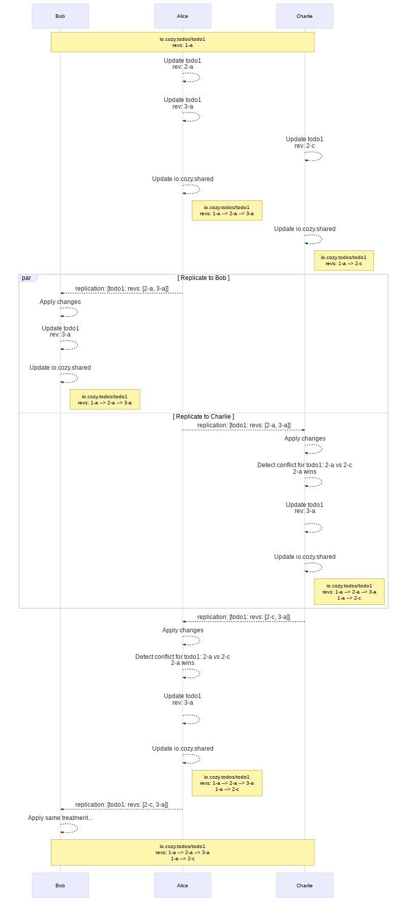
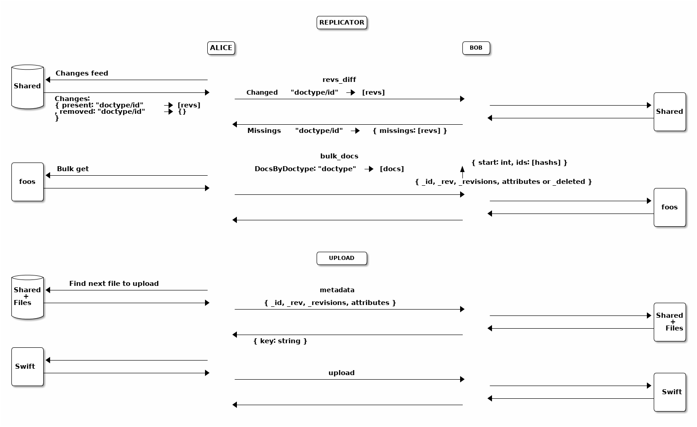
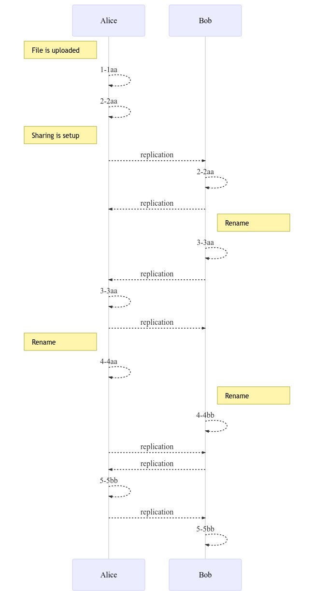
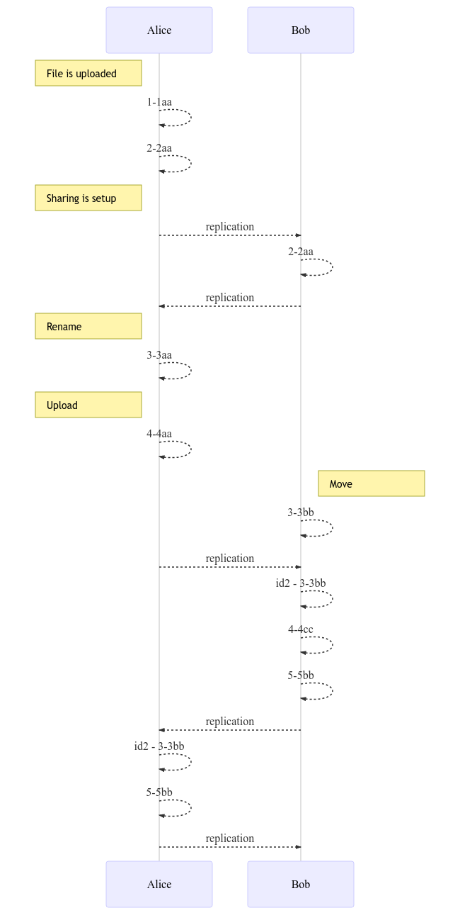

# Sharing design

## Baseline

Here we detail the baseline of the Cozy sharing design and provide some core
statements.

### Data sync

- The shared data is duplicated among members: it is both on the sharer's cozy
  (the owner), and on the recipients' cozy. This is a core difference compared
  to a federated sharing such as the one in
  [NextCloud](https://docs.nextcloud.com/server/latest/user_manual/files/federated_cloud_sharing.html).
- The [CouchDB replication
  protocol](https://docs.couchdb.org/en/stable/replication/protocol.html) is
  used to synchronize the documents. It means that the documents will be same
  on the owner side and on the recipients side ("symmetric sharing").
- The applications say what is shared, the cozy stack synchronizes that. The
  stack does the low-level work and gives primitives to the applications. The
  applications must use them in a responsible manner, and in particular, to
  avoid transitivity issues.
- The applications should know how to deal with documents' conflicts, e.g. what
  to do with a document updated by several members at the same time with
  different content. At least, the default [CouchDB
  behaviour](https://docs.couchdb.org/en/stable/replication/conflicts.html) to
  handle conflicts and select winning revisions should be acceptable if the
  applications don't do anything to detect and resolve conflicts.

### Contacts discovery

- A sharer may not know the addresses of the recipients' cozy instances, but
  he/she has a way to send them an URL on his/her cozy to start the process.

### Recipient preview

- A recipient can preview a sharing before accepting it if the application
  supports this option. Else, he/she will have only the description and rules to
  make his/her mind about accepting or refusing the sharing.

### Specific data type support

- For files and folders, the documents replication process (the replicator) is
  customized to handle the specificities of the
  [io.cozy.files](https://github.com/cozy/cozy-doctypes/blob/master/docs/io.cozy.files.md)
  doctype.
- The applications must be able to work with broken
  [relationships](https://github.com/cozy/cozy-doctypes/#relationships) between
  documents, which can happen if one shares a document without its relationships.

### Safety principles

- _First safety principle_: when a user B accepts a sharing from user A, the
  documents that were on the user B's cozy before the sharing are not sent to
  user A without an explicit action of user B (like moving a file to a shared
  directory).
- _Second safety principle_: when two users, A and B, are sharing documents, a
  change of a document on the user A's cozy can't make an exiting document of
  user B enter in the sharing.

## Setup of a sharing

### Step 1: the owner creates the sharing

One person decides to share something with other people from an application on
her cozy. In our example, Alice wants to share a todo list with her friends, Bob
and Charlie, and it is done from the _Todo_ application. The application calls
the stack with the rules for this sharing, including the documents to target and
the rights granted to the recipients, to add/update/delete todos. It also
specifies the contacts with whom to share by providing their identifiers.
See the [sharing schema](#description-of-a-sharing) for a complete description
of the expected fields.

The stack persists an `io.cozy.sharings` document and sends
an email to the recipients (Bob an Charlie).

### Step 2: a recipient accepts the sharing

A recipient, let’s say Bob, receives the email and clicks on the link. His
browser shows him the _Todo_ application on Alice’s Cozy so that he can preview
the todo list, and a modal asks him if he wants to continue the sharing
acceptation workflow. If he does, a form will ask him what is the address of his
Cozy (the form can be pre-filled if he has already accepted another sharing in
the past). After he has filled the form and submitted it, he is redirected on
his Cozy. If he is not logged in, he has to login first. Then, a page describes
him how the sharing will work and what technical permissions it implies. It also
asks him to confirm the sharing. If he accepts, his instance will send to
Alice’s instance the answer.

### Step 3: the initial replication starts

Alice’s Cozy instance creates some tokens and sends them with other informations
such as the response of the answer request from Bob’s instance. At this moment,
both instances are ready to start to replicate data to the other instances. So,
let’s do the initial replication.

Alice’s instance starts to fill the `io.cozy.shared` database with all the
documents that match a rule of the sharing (except the rules with
`local: true`), and create triggers for the future documents to be also added in
this database (the exact triggers depend of the parameters of the rules). And,
when done, it creates a job for the replicator, and setups a trigger for future
changes in the `io.cozy.shared` to start a replicator job. This mechanism is
further explained in [the data sync](#data-sync) section.

Bob’s instance also checks if any document matches a sharing rule. In most
cases, it won’t. But in some very special cases (e.g. a previous revoked sharing
on the same documents), there are some documents that match a rule. They are
added to the `io.cozy.shared` database, but with a `conflict` flag. They won’t
be replicated unless Bob accepts to in his _Todo_ application. Triggers are also
added on Bob’s instance for filling the `io.cozy.shared` database, and to call
the replicator after that.

**Note:** there is a lock around the initial filling of the
`io.cozy.shared` database to avoid concurrency issues if two recipients accept
the sharing at the same time.

## Data sync

As stated in the baseline, the shared data is copied among the databases of all
the members for a sharing.
Therefore, contrarily to centralized or federated sharing, where the same data
is accessed by all members, extra work must be done to replicate changes between
all members.

The replication mode is specified in a sharing rule for each document action:
add, update or delete. It can be:

- `none`: the changes won't be replicated between members.
- `push`: only the changes made by the owner will be propaged to the recipients.
- `sync`: the changes made by any member are propagated to the other members.

See the [sharing schema](#description-of-a-sharing) for more details and
examples.

The data synchronization is based on the document's revisions. Each time a
document is updated in database, a new revision is created with the following
format: `1-abc`, where `1` is a number incremented at each new change and `abc`
a hash of the document.
The revisions history of each shared document is saved in a `io.cozy.shared`
document. This history is used to compare revisions between sharing members and
propagate updates. Hence, not only the shared documents are synced, but also
their whole revisions history through the `io.cozy.shared` database. See the
[revisions syncing](#revisions-syncing) section for a complete example.

### General workflow

In the following, we assume the a `sync` sharing for all actions between Alice,
Bob and Charlie.

**Step 1:** a todo item is added on Bob’s Cozy, a trigger is fired and it adds
the new document to the `io.cozy.shared` database

**Step 2:** a debounced trigger on the `io.cozy.shared` database is used to
start a replicator

**Step 3:** the replicator does the following steps

- it queries a local document of the `io.cozy.shared` database to get the last
  sequence number of a successful replication
- with this sequence number, it requests the changes feed of `io.cozy.shared`
  with a filter on the sharing id
- the results is a list of document doctype + id + rev that is sent to Alice’s
  Cozy
- Alice’s Cozy checks which revisions are known, and send a response with the
  list of those that are not
- for each not known revision, Bob’s Cozy send the document to Alice’s Cozy
  (in bulk)
- and, if it’s all good, it persists the new sequence number in the local
  document, as a start point for the next replication

**Step 4:** the changes are put in the `io.cozy.shared` database on Alice’s Cozy

**Step 5:** it starts a replicator on Alice’s Cozy

**Step 6:** the replicator send the changes to Charlie’s Cozy, all the cozy
instances are synchronized again!

**Note:** when a todo item is moved fron a shared todo list to a not shared todo
list, the document in `io.cozy.shared` for the todo item is kept, and the
sharing id is associated to the keyword `removed` inside it. The `remove`
behavior of the sharing rule is then applied.

### Revisions syncing

Here, we detail the internals of the revisions-based syncing mechanism through
an example: Alice, Bob and Charlie share a Todo with the id "todo1". Note that
in reality this id would be an UUID, but we give it a simple name for the sake
of clarity.

This Todo had only one update (its creation), made by Alice that generated the
revision `1-a`.
After the initial replication, all the members have a `io.cozy.shared` document,
with this sole revision as history. This history is
actually a tree: when a CouchDB conflict occurs, a new branch is created,
containing the losing revision, so we can keep track of it and avoid losing any
data. Note the document id is in the form `<doctype>/<docid>` to easily
reference the shared document. Here, it is `io.cozy.todos/todo1`.

In the sequence diagram below, we illustrate the steps occuring when Alice
generates updates. We also illustrate how a CouchDB can occur and how it is
handled, by making Charlie updating the same document than Alice at the same
time. This update leads to a conflict between the revisions `2-a`, generated by
Alice, and `2-c`, generated by Charlie: a winning revision is then elected
by CouchDB, `2-a`, but `2-c` is saved in another branch of the revision tree.
Thanks to it, the conflict is propagated to other members that will be able to
resolve it through the Todo application (by manually erasing or merging the
conflicted revision for instance).

Eventually, all members converge to the same state with the same docs and the
same revisions histories.

### CouchDB conflicts

A [CouchDB
conflict](https://docs.couchdb.org/en/stable/replication/conflicts.html) is when
a document has conflicting revisions, i.e. it has at least two revisions
branches in its revision history. Hence, these conflicts are made on the
database level.
[By
design](https://docs.couchdb.org/en/stable/replication/protocol.html#upload-batch-of-changed-documents),
CouchDB can produce conflicts in its replication protocol, as the revision
history is replicated and forced among nodes.

We detail [here](https://docs.cozy.io/en/cozy-stack/couchdb-quirks/#conflicts)
how a CouchDB conflict can be made.

In the particular case of files and folders, we implemented specific strategies
to avoid having to deal with conflicts at the application level: the stack is
able to prevent CouchDB conflicts for `io.cozy.files` documents and enforce
[reconciliation](#conflict-resolution) when possible. We also detail what is
done when [no reconciliation](#conflict-with-no-reconciliation) can be made.

## Files and folders

### Why are they special?

Files are special for several reasons. First and foremost, they have a binary
attached to them that can be quite heavy. The stack also enforces some rules on
them (e.g. a file can’t be added to a deleted folder) and has some specific code
for the tree nature of files and folders (e.g. a permission on a folder is
inherited on all the files and folders inside it, even if they are several
levels below). Thus, the workflow explained just before is not compatible with
the files.

As we need to introduce some code specific to the files, we have also wanted to
improve the sharing of files. First, we don’t want to force the recipients to
put the shared folder at exactly the same place as the owner. In fact, we think
that putting the shared folder in a folder called `Shared with me` is more
friendly. We also think that a file that has been shared in the past but is no
longer (the sharing has been revoked) can evolve on both the owner’s cozy and on
the recipients’ cozy in different ways, and in such a case, it’s more logical to
consider them as different files. These two reasons implies, on a technical
level, that the identifiers for files and folders are not the same on the owner
and the recipients of a sharing. The replicator will translate the identifiers
from one system to another during the replications. Of course, it will also
translate the `id` in the sharing rules, and the `dir_id` to preserve the
relationship between a file and its parent folder. The `path` attribute will be
seen as a cache, and recomputed when a cozy instance receives a folder document
from a sharing replication.

We will continue to have a replication as close to the CouchDB replication as
possible. It means we synchronize a state, and not looking for the history of
operations like [cozy-desktop](https://github.com/cozy-labs/cozy-desktop/) does.
It is less accurate and can lead more often to conflicts. The cozy instances are
expected to be online most of the time and have a short delay for replications:
we think that the conflicts will happen only on rares occasions. This make
acceptable to take this shortcut. And, in case of conflicts, we will preserve
the content of the files (no data loss), even if it means duplicating the files.

### How a sharing involving files works?

When a sharing involves a rule on the `io.cozy.files` doctype, a folder is
created on the recipients cozy where the files will be put. It is created inside
the `Shared with me` folder by default, but can be moved somewhere else after
that. The folder won’t be synchronized its-self later, and if the folder is
trashed, the sharing is automatically revoked. As it is not a reversible action,
a confirmation is asked before doing that.

**Note:** we will forbid the sharing of the root of the virtual file system, of
the trash and trashed files/folders, and of course the `Shared with me` folder.

The step 3 described above, aka the replicator, will be more complicated for
folders and files. First change, it will work on two phases: 1. what can be
synchronized without transfering the binaries first, and 2. the synchronization
of files with a binary attached. Second change, the replicator will acquire the
Virtual File System lock on the cozy instance where it will write things to
ensure the consistency of what it writes. Third change, before inserting a
folder or file in the database, the replicator checks that its parent exists,
and if it’s not the case, it creates it. Last change, we will avoid CouchDB
conflicts for files and folder by using a special conflict resolution process.

### Sequence diagram

### Conflict resolution

In the case of `io.cozy.files` documents, we prevent CouchDB conflicts to happen
by implementing specific strategies. Here, we detail the conflicts situations
where a resolution is possible:

1. When two cozy instances have modified the same file concurrently
2. Same for a folder
3. When two files or folders are renamed concurrently to the same name inside
   the same directory
4. When a file or folder is created or updated on cozy instance while the parent
   directory is trashed concurrently on another cozy instance.

For 1. and 2., we will reconciliate the changes except for a file with two
versions having a distinct binary (we rely on `size` and `checksum` to detect
that). In such a case, we create a copy of the file with one version, while
keeping the other version in the original file (the higher revision wins).

For 3., we say that the owner instance wins: the file with the name in conflict
on the owner instance will keep its name, and the other file with the same name
will be renamed. This rule helps to minimize the number of exchanges between
the cozy instances, which is a factor of stability to avoid more conflicts.

For 4., we restore the trashed parent, or recreate it if it the trash was
emptied.

### Conflict with no reconciliation

When a file is modified concurrently on two cozy instances, and at least one
change involve the content, we can't reconciliate the modifications. To know
which version of the file is the "winner" and will keep the same identifier, and
which version is the "loser" and will have a new identifier, we compare the
revisions and the higher wins.

This conflict is particulary tricky to resolve, with a lot of subcases. In
particular, we try to converge to the same revisions on all the instances for
the "winner" file (and for the "loser" too).

We have 3 sets of attributes for files:

-   `size` and `md5sum` (they change when the content has changed)
-   `name` and `dir_id` (they change when the file is moved or renamed)
-   `created_at`, `updated_at`, `tags`, `referenced_by`, etc.

For the first two sets, the operation on the Virtual File System will needs to
reach the storage (Swift), not just CouchDB. For the third set, it's easy: we
can do the change at the same time as another change, because these attributes
are only used in CouchDB. But we can't do a change on the first two sets at the
same time: the Virtual File System can't update the content and move/rename a
file in the same operation. If we needs to do both, it will generate 2 revisions
in CouchDB for the file.

**Note:** you can see that using CouchDB-like replication protocol means that we
have some replications that can look useless, just some echo to a writing. In
fact, it is used to acknowledge the writing and is helpful for conflict
resolutions. It may be conter-intuitive, but removing them will harm the
stability of the system, even if they do nothing most of the time.

#### Example 1

Here, Alice uploads a file on her Cozy. It creates two revisions for this file
(it's what the Virtual File System does). Then, she shares the directory with
this file to her friend Bob. When Bob accepts the sharing, the file is sent to
his Cozy, with the same revision (2-2aa).

Later, Bob renames the file. It creates a new revision (3-3aa). The change is
replicated to Alice's Cozy. And we have a replication from Alice to Bob to
ensure that every thing is fine.

Even later, Alice and Bob both renames the file at the same time. It creates a
conflict. We have a first replication (from Alice to Bob), but nothing happens
on B because the local revision (4-4bb) is greater than the candidate revision
(4-4aa) and the content is the same.

Just after that, we have a revision on the opposite direction (from Bob to
Alice). The candidate revision wins (4-4bb), but for files, we don't use CouchDB
conflict, thus it's not possible to write a new revision at the same generation
(4). The only option is to create a new revision (5-5bb). This revision is then
sent to Bob: Bob's Cozy accepts the new revision even if it has no effect on the
file (it was already the good name), just to resolve the conflict.

#### Example 2

Like in the last example, Alice uploads a file and share a directory to Bob with
this file, Bob acccepts. But then, several actions are made on the file in a
short lapse of time and it generates a difficult conflict:

-   Alice renames the file, and then uploads a new version with cozy-desktop
-   Bob moves the file to a sub-directory.

So, when the replication comes, we have two versions of the file with different
name, parent directory, and content. The winner is the higher revision (4-4aa).
The resolution takes 4 steps:

1. A copy of the file is created from the revision 3-3bb, with the new
   identifier id2 = XorID(id, 3-3bb).
2. The new content is written on Bob's Cozy: we can't use the revisions 3-3aa
   (same generation as 3-3bb) and 4-4aa (it will mean the conflict is fixed, but
   it's not the case, the filenames are still different), so a new revision is
   used (4-4cc).
3. The file is moved and renamed on Bob's Cozy, with a next revision (5-5bb).
4. The two files are sent to Alice's Cozy: 5-5bb is accepted just to resolve the
   conflict, and id2 is uploaded as a new file.

## Schema

### Description of a sharing

-   An identifier (the same for all members of the sharing)
-   A list of `members`. The first one is the owner. For each member, we have
    the URL of the cozy, a contact name, a public name, an email, a status, a
    read-only flag, and some credentials to authorize the transfer of data
    between the owner and the recipients. The status can be:
    -   `owner` for the member that has created the sharing
    -   `mail-not-sent` for a member that has been added, but its invitation
        has not yet been sent (often, this status is used only for a few
        seconds)
    -   `pending` for a member with an invitation sent, but who has not clicked
        on the link
    -   `seen` for a member that has clicked on the invitation link, but has not
        setup the Cozy to Cozy replication for the sharing
    -   `ready` for a member where the Cozy to Cozy replication has been set up
    -   `revoked` for a member who is on longer in the sharing
-   A `description` (one sentence that will help people understand what is
    shared and why)
-   A flag `active` that says if the sharing is currently active for at least
    one member
-   A flag `owner`, true for the document on the cozy of the sharer, and false
    on the other cozy instance
-   A flag `open_sharing`:
    -   `true` if any member of the sharing except the read-only ones can add a
        new recipient
    -   `false` if only the owner can add a new recipient
-   Some technical data (`created_at`, `updated_at`, `app_slug`, `preview_path`,
    `triggers`, `credentials`)
-   A number of files to synchronize for the initial sync,
    `initial_number_of_files_to_sync` (if there are no files to sync or the
    initial replication has finished, the field won't be here)
-   A `shortcut_id` with the identifier of the shortcut file (when the
    recipient doesn't want to synchronize the documents on their Cozy instance)
-   A list of sharing `rules`, each rule being composed of:
    -   a `title`, that will be displayed to the recipients before they accept
        the sharing
    -   a `doctype`
    -   a `selector` (by default, it’s the `id`) and `values` (one identifier, a
        list of identifiers, files and folders inside a folder, files that are
        referenced by the same document, documents bound to a previous sharing
        rule)
    -   `local`: by default `false`, but it can be `true` for documents that are
        useful for the preview page but doesn’t need to be send to the
        recipients (e.g. a setting document of the application)
    -   `add`: a behavior when a new document matches this rule (the document is
        created, or it was a document that didn’t match the rule and is modified
        and the new version matches the rule):
        -   `none`: the updates are never propagated (the default)
        -   `push`: the updates made on the owner are sent to the recipients
        -   `sync`: the updates on any member (except the read-only) are
            propagated to the other members
    -   `update`: a behavior when a document matched by this rule is modified.
        Can be:
        -   `none`: the updates are never propagated (the default)
        -   `push`: the updates made on the owner are sent to the recipients
        -   `sync`: the updates on any member (except the read-only) are
            propagated to the other members
    -   `remove`: a behavior when a document no longer matches this rule (the
        document is deleted, or it was a document that matched the rule, and is
        modified and the new version doesn’t match the rule):
        -   `none`: the updates are never propagated (the default)
        -   `push`: the updates made on the owner are sent to the recipients
        -   `sync`: the updates on any member (except the read-only) are
            propagated to the other members
        -   `revoke`: the sharing is revoked.

#### Example: I want to share a folder in read/write mode

-   rule 1
    -   title: `folder`
    -   doctype: `io.cozy.files`
    -   values: `"ca527016-0d83-11e8-a580-3b965c80c7f7"`
    -   add: `sync`
    -   update: `sync`
    -   remove: `sync`

#### Example: I want to share a playlist where I’m the only one that can add and remove items

-   rule 1
    -   title: `playlist`
    -   doctype: `io.cozy.music.playlists`
    -   values: `"99445b14-0d84-11e8-ae72-4b96fcbf0552"`
    -   update: `none`
    -   remove: `revoke`
-   rule 2
    -   title: `items`
    -   doctype: `io.cozy.files`
    -   selector: `referenced_by`
    -   values: `"io.cozy.files/ca527016-0d83-11e8-a580-3b965c80c7f7"`
    -   add: `push`
    -   update: `none`
    -   remove: `push`

### `io.cozy.shared`

This doctype is an internal one for the stack. It is used to track what
documents are shared, and to replicate changes from one Cozy to the others.

-   `_id`: its identifier is the doctype and id of the referenced objet,
    separated by a `/` (e.g.
    `io.cozy.contacts/c1f5dae4-0d87-11e8-b91b-1f41c005768b`)
-   `_rev`: the CouchDB default revision for this document (not very meaningful,
    it’s here to avoid concurrency issues)
-   `revisions`: a tree with the last known `_rev`s of the referenced object
-   `infos`, a map of sharing ids → `{rule, removed, binary}`
    -   `rule` says which rule from the sharing must be applied for this
        document
    -   `removed` will be true for a deleted document, a trashed file, or if the
        document does no longer match the sharing rule
    -   `binary` is a boolean flag that is true only for files (and not even
        folders) with `removed: false`
