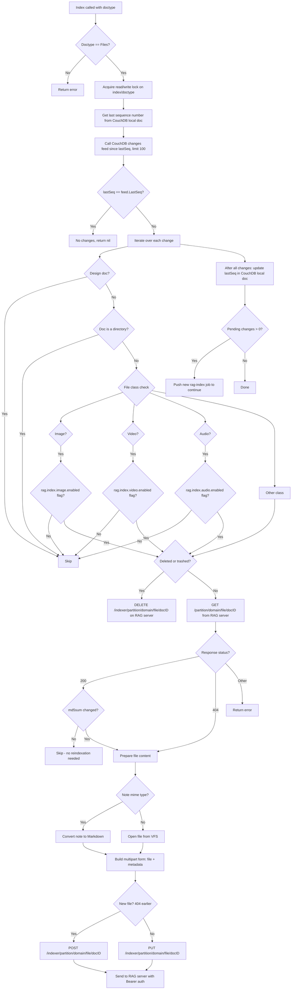

```mermaid
flowchart TD
    A[Index called with doctype] --> B{Doctype == Files?}
    B -- No --> ERR[Return error]
    B -- Yes --> C[Acquire read/write lock on index/doctype]
    C --> D[Get last sequence number from CouchDB local doc]
    D --> E[Call CouchDB changes feed since lastSeq, limit 100]
    E --> F{lastSeq == feed.LastSeq?}
    F -- Yes --> NOOP[No changes, return nil]
    F -- No --> G[Iterate over each change]

    G --> H{Design doc?}
    H -- Yes --> SKIP[Skip]
    H -- No --> I{Doc is a directory?}
    I -- Yes --> SKIP
    I -- No --> J{File class check}

    J --> J1{Image?}
    J1 -- Yes --> J1a{rag.index.image.enabled flag?}
    J1a -- No --> SKIP
    J1a -- Yes --> K

    J --> J2{Video?}
    J2 -- Yes --> J2a{rag.index.video.enabled flag?}
    J2a -- No --> SKIP
    J2a -- Yes --> K

    J --> J3{Audio?}
    J3 -- Yes --> J3a{rag.index.audio.enabled flag?}
    J3a -- No --> SKIP
    J3a -- Yes --> K

    J --> J4[Other class] --> K

    K{Deleted or trashed?}
    K -- Yes --> DEL[DELETE /indexer/partition/domain/file/docID on RAG server]
    K -- No --> L[GET /partition/domain/file/docID from RAG server]

    L --> M{Response status?}
    M -- 200 --> N{md5sum changed?}
    N -- No --> SKIP2[Skip - no reindexation needed]
    N -- Yes --> P[Prepare file content]
    M -- 404 --> P
    M -- Other --> ERR2[Return error]

    P --> Q{Note mime type?}
    Q -- Yes --> R[Convert note to Markdown]
    Q -- No --> S[Open file from VFS]

    R --> T[Build multipart form: file + metadata]
    S --> T

    T --> U{New file? 404 earlier}
    U -- Yes --> V[POST /indexer/partition/domain/file/docID]
    U -- No --> W[PUT /indexer/partition/domain/file/docID]

    V --> X[Send to RAG server with Bearer auth]
    W --> X

    G --> Y[After all changes: update lastSeq in CouchDB local doc]
    Y --> Z{Pending changes > 0?}
    Z -- Yes --> AA[Push new rag-index job to continue]
    Z -- No --> DONE[Done]
```